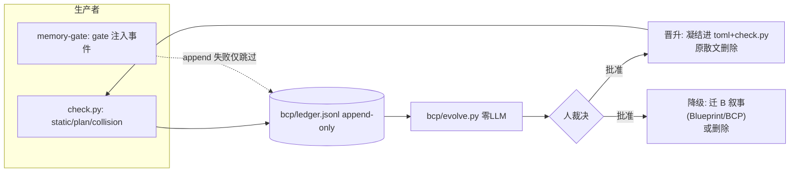
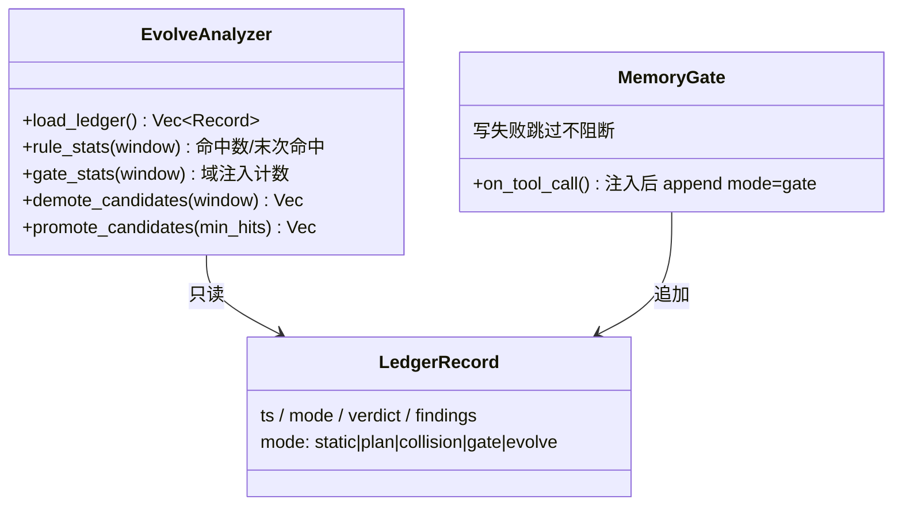
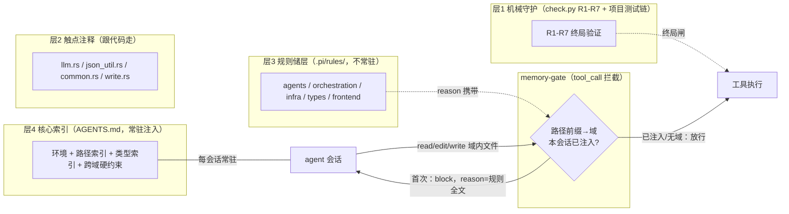
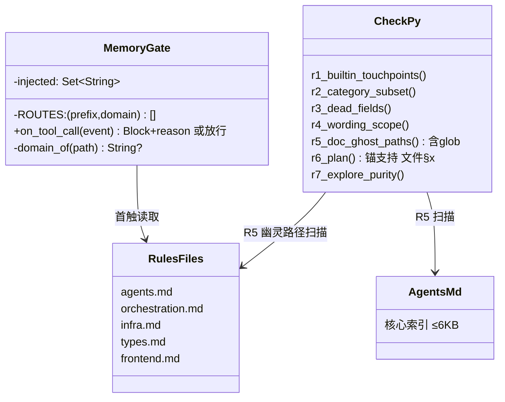

# BCP — 蓝图完形协议（Blueprint Completion Protocol）

> **范式定论**。开发被组织为一个循环：人类裁决设计（B）→ 符号组装上下文（P）→ 阳完形产出代码（C）→ 阴·机械对碰守接缝 → 固化回流。
> LLM 是条件生成器（词语接龙与完形填空），不是创作者。BCP 把开发组织成「补全」而非「创作」：计划定义空格的形状，模型填空。

## 工作流总图

```
意图(NL) ──人类裁决──▶ B(蓝图) ──检索熔化──▶ P(计划) ──阳完形──▶ C(代码)
                      固化回流 ◀──────── 阴·机械对碰 ◀───────────┘
```

四个对象沿链相变：**B 蓝图**（固，人类裁决）→ **P 计划**（瞬态，agent 消费）→ **C 代码**（固，唯一实现事实）→ **A 规则内核**（液，回流沉淀）。两个关键相位：**阳完形**（LLM 填空，与元组装并列的两个概率相位之一）与**阴对碰**（零 LLM 机械裁决）。

> 配套工件（§8.1 最小契约）：转化协议 `plan.md`（P 的 schema）· 工作流内核 `.pi/APPEND_SYSTEM.md`（A 的注入样本）· 机械对碰器 `bcp/check.py` + `bcp/bcp.toml`（阴）· 证据账本 `bcp/ledger.jsonl` · 实现事实 `AGENTS.md`。
>
> **宿主无关**：本 spec 与 `bcp/` 机械件只依赖 Python 3.11+ 标准库；`.pi/` 件为 pi 宿主适配层（换宿主只需重写该层，§8.1）。历史定论沿革（V80–V83）详见 taiji 仓库 `Blueprint.md`（冻结档案）。

---

## 0. 哲学基础

1. **态射分段可检**。代码语言是自然语言的态射，但意图→代码的直接映射不是函数（一对多）。BCP 插入中间对象，把全局映射拆成三段局部映射：`意图 →B→ P →C`，逐段校验交换性。全局无损不可直接校验；**分段可检且误差逐段可归因 = 接近无损的可执行定义**。
2. **预训练范式对齐**。完形的工程含义：给足上下文骨架（接口、不变量、验收命令），生成落在分布内。空格越形状化，补全越收敛。
3. **无损判据三条件**。① 覆盖——下游对上游每个承诺有对应物；② 无发明——下游不引入上游没有的承诺；③ 引用可解析——跨工件引用全部落锚。损耗从静默事件变成可检测事件，这就是「接近无损」的全部机制。

## 1. 对象模型（气液固）

| 对象 | 相态 | 受众 | 生命周期纪律 |
|---|---|---|---|
| 会话上下文 | **气**（容器本身） | — | 每任务新建，天然消散 |
| P 计划 | **瞬态内容物** | agent | 注入→完形→删除；成功即消散；失败压缩为失败模式典藏（见下）；尸体可留档审计，**不得回注后续容器** |
| A 规则内核 | **液**（储层） | agent | 持续形变（汇流/晋升/降级）；按需倾倒；受墙约束（§6） |
| B 蓝图 | **固**（晶体） | 人类 | 结晶需人类批准（§4.1）；按需检索，不常驻 |
| C 代码 | **固**（晶体） | 机器+人类 | 唯一实现事实；接口与类型的最终仲裁 |

四条纪律：

- **相态判据是形变方式，不是注入频率**：A 每次会话被注入，但它本体在容器外被每个任务的回流持续重塑——这是液体。B/C 只在越垒时相变——这是晶体。
- **派生文档不允许原创事实**：A（含嵌套文件、skill 手册等派生层）的每条事实性断言必须可溯源到代码或 B。违反即腐烂（先例：CLI 手册滞留已删除的恢复机制）。
- **跨任务连续性只由回流沉淀物（A/B/C）承载**。过程上下文跨任务存活 = 上一任务的空格形状污染下一任务的补全。
- **失败典藏永续（失败 ≠ 废料）**：FAIL 的 P、阴驳回的理由、阳的无效尝试，必须压缩为**原子模式**（标题 + 规避句，≤200 字符），追加写入 `bcp/ledger.jsonl`（mode=failure）与 `.pi/rules/<域>.md`（避坑条目）。后续元相位的先验注入只含失败模式的「标题+规避句」，不注入失败的具体上下文——**模式是规则（液体，可回注），尸体是过程上下文（禁回注）**，与上一条不冲突。失败模式比成功模式更有进化价值：系统不重复踩同一个坑。

## 2. 工作流：转化链与四乐章

> 每个任务 = 一个完整循环。接缝表定责任（哪段错了归谁），四乐章定时序（先做什么后做什么）。

### 2.1 转化链与接缝

| 接缝 | 检查类型 | 范式承诺 |
|---|---|---|
| 意图→B | 不可机械校验（设计主权，分布外） | 只承诺留痕（B 定论记录），不承诺无损 |
| B→P | 引用解析 + 覆盖检查 | P 的 blueprint 锚必须落进 B 实际章节 |
| P→C | 声明对碰 + accept 判据 | C 恰好填满 P 的空格，双向（做了没声明 / 声明了没做） |
| C→A/B | 回流弱信号（warn 级） | 检测「该回流未回流」的信号，不阻断 |

### 2.2 四乐章（三相循环的开发版）

| 乐章 | 相变 | 职责 | LLM 触点 |
|---|---|---|---|
| 元组装 | 熔化+汽化 | 按 §2.3 注入开关读 B 相关章节 + A 倾倒样本 + 代码索引对账 → 产出 P | 起草 P 内容（schema 由协议定，模型填空不定义空格） |
| 阳完形 | 气态执行 | 消费 P + A 内核产出代码，accept 即空格填满 | **唯一概率相位之二：完形 C** |
| 阴对碰 | 液化 | 机械对碰产出裁决与账本记录（§3） | **零 LLM** |
| 固化回流 | 固化+汇流 | 避坑→A（无垒）、定论→B（需批准）、事实→C（§4） | 零 LLM（候选可由 LLM 起草，采纳是人的） |

### 2.3 双模注入（探索裸跑 / 生产先验）

> 证据（WikiSkill Table 3）：执行类任务提前注入知识库会让阳走捷径，产出的轨迹对技能进化贬值（-2.8%）。

| 模式 | 计划标记 | 元相位纪律 |
|---|---|---|
| **探索**（技能进化 / 轨迹采集类任务） | `mode: explore` | **空上下文注入**：不读储层、不给案例召回，只给环境工具——阳在裸跑中犯错，产出高纯度原始轨迹 |
| **生产**（推理类任务，缺省） | `mode: infer` | 恢复默认注入：UCB top-K + 案例召回，用储层加速决策 |

- **机械面（R7）**：计划头 `mode` 字段必检——产出 `SKILL.md` 或标记 `skill_evolution: true` 的任务必须 `mode: explore`，否则 FAIL。运行时注入行为静态不可检，由计划声明 + ledger 审计兜底。
- **纪律钩子**：探索任务的元组装禁止检索 `.pi/rules/` 与归藏资产（工作流内核 §2）。

### 2.4 产出物契约（文本技能一等公民）

> 证据（WikiSkill）：纯文本 Markdown 规则平均 +17~24% 且跨模型迁移好；强制编译 Python 的工程成本（编译耗时 / 冒烟压测）在绝大多数场景 ROI 为负。

- **默认产物双轨**：阳产出 `deliverables/SKILL.md`（纯文本规则 + Frontmatter 元数据）+ `deliverables/declaration.yaml`（结构化自声明）。
- **编译降级为可选优化**：Python 固化仅在 ① 人类显式 `--compile-python`，或 ② 文本规则验证集成功率 ≥95% 时触发一次；其余场景文本即技能。
- **与 taiji 蓝图定论⑥不冲突**（档案）：文本技能走 prompt 注入轨道，不是机械执行体——「执行体统一 Python」继续成立；运行时文本技能类型（taiji `SkillKind::Text`）为候选扩展（§8.2 待做）。

## 3. 阴·机械对碰

| 对碰层 | 内容 | 失败路由 | 同构 |
|---|---|---|---|
| 律令层 | 引用解析、声明对碰（双向）、发明检测 | 打回 P（重组装） | BackToMeta |
| 原子判据 | accept 命令全绿 | 打回 C（重完形） | BackToZhouyi |
| 经验层 | A 注入的软规则 | 不打回，记入账本 | soft violation |

（同构列为 taiji 内核的对应路由名，档案对照。）

- **失败必须标注断的是哪个接缝**：组装错改计划，完形错改代码，两类错误两类打回，不混。
- **check 禁止 LLM judge**：概率验证概率 = 阳自查自证。对碰器只能是确定性程序（grep/AST/命令执行/diff）。
- **门控顺序（双保险，符号阀前置）**：① 经验阀——验证集分数上涨只产生**采纳候选**；② 符号阀——`check.py --collision` 的引用悬空类机械检查（模板开箱 R5–R7；注入风险 / 路径逃逸等为项目专属，按 §5.4 案例凝结进 R1–R4）**一票否决**，验证集满分不抵消符号 FAIL。统计分数进不了判据表（taiji 蓝图定论⑬，档案），只能决定候选优先级——软分数可以提效，不可以越权。

## 4. 固化回流

> 回流是循环的固定相变，不是「记得做的美德」。本节回答三个问题：谁裁决（4.1 能垒）、怎么变（4.2 演化算子）、凭什么变（4.3–4.6 证据流与报告器）。

### 4.1 能垒

**人类批准 = 结晶能垒**。定论入 B 需人类裁决（晶体不自校正，错误定论污染此后所有检索）；避坑汇入 A 无垒（液体自校正，错规则会被演化算子冲掉）；经验规则律令化（凝结进 check）无需人类能垒——判据可机械验证，证据即凭证。

### 4.2 演化算子

- **证据账本**：对碰器每次运行追加 `bcp/ledger.jsonl`（rule_id / severity / finding / 时间）。这是规则的违反证据流。
- **晋升**：散文规则反复违反且可机械化 → 凝结为 check 规则（bcp.toml + check.py），从 A 内核删除原散文。
- **降级**：长期零命中且未防过事故 → 迁入 B 叙事或删除。
- **回流协议**：任务终态固定产出 ≤3 条避坑候选（入 A，无垒）+ 0–1 条定论候选（入 B，需批准）。FAIL 任务额外强制产出一条失败模式（mode=failure 入账本 + 避坑入 A，见 §1）。可复用的成功轨迹按 §2.4 双轨沉淀，编译不默认。

### 4.3 统一证据流

> 设计动因：§4.2 的晋升/降级算子原本无消费者。定论：证据流统一进 `bcp/ledger.jsonl`（append-only），新增零 LLM 报告器产出候选数据，裁决权在人。

| 生产者 | mode | 内容 |
|---|---|---|
| check.py | static / plan / plan+collision | findings[rule,sev,msg]（既有） |
| memory-gate | gate | 首次注入事件 {domain, file}；append 失败仅跳过，绝不阻断工具执行 |
| evolve.py | evolve | 每次报告的审计痕迹（候选清单） |
| 固化回流·失败典藏 | failure | 压缩失败模式 {title, avoidance, domain}（§1） |

总装图：



### 4.4 evolve.py 报告器（零 LLM，纯标准库，守 §8.1 移植契约）

- 输入：`bcp/ledger.jsonl` + check.py 源中的规则名注册表（正则机械提取 seam 表键，不建副本）+ `.pi/rules/` 清单。
- 输出：纯文本报告——① 各 check 规则全历史/窗口内命中数与末次命中；② 各域 gate 注入计数；③ 降级候选（窗口内零命中且低频高害存疑者，只列数据）；④ 从未注入的规则文件（死重候选；冷启动期改列「待积累」，见 §4.6）；⑤ 高频 FAIL 规则（强化证据）。
- 参数：`--window N`（天，默认 30）、`--min-hits M`（默认 3）、`--ledger <path>`（默认 `bcp/ledger.jsonl`，覆盖账本路径——测试注入空账本验证冷启动用）。退出码恒 0（报告非裁决）。
- 每次运行追加 mode=evolve 审计记录（候选以 findings WARN 形式入账）。

部件图：



### 4.5 晋升与降级执行（守 §4.1）

- **晋升**：报告给出高频候选 → 人批准 → agent 执行（散文规则凝结进 `bcp/bcp.toml` + `bcp/check.py`，原散文从 rules 文件删除）→ `/check` 全绿即凭证，无额外能垒。
- **降级**：报告给出零命中/死重候选 → **必经人裁决**（「未防过事故」不可机械测；零命中的低频高害规则如 R1/R2/R4 不宜自动降）→ 人批准后迁 B 叙事（项目 Blueprint.md / 本仓库 BCP.md）或删除。

### 4.6 冷启动语义（gate 证据无效期）

> 设计动因：管道刚落地时账本 0 条域注入事件，④ 节把全部规则文件误标「死重候选」（2026-09-07 首份报告实证，5 文件全列）。定论：死重判定必须有管道活性证据。

- **冷启动判定**：账本中无任何**域注入**事件（mode=gate 且 kind=domain；big-read / compact-restore 不算）。
- **冷启动报告**：④ 节不列死重候选，改列全域「待积累」清单；报告头部标注 `[冷启动]` 状态。
- **常态门槛**：≥1 域有注入即管道活性已证，其余未注入域照列死重候选（报告非裁决，人看数据判断）。
- **set 语义红线**：死重判定只用「从未注入」（set 语义），禁用「注入计数低」推断死重——gate 每域每会话去重，计数天然低频，低计数 ≠ 死重。
- **审计痕迹**：mode=evolve 记录增补 `cold_start` 布尔字段。

## 5. 记忆分层（A 内核四层，宿主侧落地）

> 设计动因：pi 无跨会话记忆，上下文文件即记忆。AGENTS.md 全量 42KB 常驻违反 §6 墙纪律；嵌套文件+自觉 read = 纪律依赖反模式（§7.5）。定论：规则按可靠性分四层，每条规则必须落一层，不允许无主散文。

### 5.1 四层（按可靠性降序）

| 层 | 机制 | 触发方式 | 腐烂面 |
|---|---|---|---|
| 1 凝结 | 规则 → check.py R 规则 / 项目测试链 | 违反即红，零阅读依赖 | 无（跟代码走） |
| 2 触点注释 | 单文件局部规则 → 代码触点 doc comment | 改代码必读文件，任务本身即触发 | 无（删代码即删规则） |
| 3 机械注入 | 跨模块规则 → `.pi/rules/<域>.md` + memory-gate 扩展 | `tool_call` 按文件路径前缀拦截，首次触碰域 → block + reason 携带规则全文，重试即带规则执行 | 每规则单一来源；R5 扫幽灵路径 |
| 4 核心索引 | AGENTS.md 只留环境信息 + 路径索引 + 类型索引 + 跨域硬约束，≤6KB | 每会话常驻 | 路径由 R5 守护 |

### 5.2 总装图



（图内域名为 taiji 实例示例，见 §5.4。）

### 5.3 部件图



（RulesFiles 为 taiji 实例示例，见 §5.4。）

### 5.4 分流审计（案例：taiji 实例原 AGENTS.md 24 节 → 去处）

| 原节 | 去处 |
|---|---|
| §0 文档首要 / §4 错误测试 / §6 无降级 / §5 解析一句话 / §17-git-checkout | 层4 核心（跨域硬约束） |
| §5 解析细则 | 层2 json_util.rs::parse_llm_json 触点 |
| §17 symlink 逃逸 / redirect SSRF / write 相对路径 | 层2 common.rs / webfetch.rs / write.rs 触点 |
| §19 ToolCall/ToolSchema 序列化 | 层2 llm.rs 触点 |
| §2 §3 §13 §19余 §20 §21 §23 | 层3 `.pi/rules/agents.md`（src/agents/） |
| §1 §7 §10 §11 §12 §14 §16 §22 §17-max_depth | 层3 `.pi/rules/orchestration.md`（src/orchestration/，src/mcp/） |
| §8 §9 §18 | 层3 `.pi/rules/infra.md`（src/infra/） |
| §17-serde(default) | 层3 `.pi/rules/types.md`（src/types/） |
| §15 | 层3 `.pi/rules/frontend.md`（src/ws/，taiji-web/） |
| §20 六触点 / §9 kind⊆cat / §13 死字段 / §14 措辞 / §16 幽灵基建 | 层1（已凝结 R1–R5，prose 收一行指针） |

（本表节号为 taiji 实例 AGENTS.md 原节号，案例档案指针。）

### 5.5 注入闸门纪律

- 拦截仅作用于 read/edit/write 三工具的 path 参数；bash 是已知缺口（改代码主路径是 edit/write，残余风险归项目 AGENTS.md 既有坏习惯条款）。
- 规则文件缺失 fail-open 放行 + notify（不能死锁）；会话内每域只拦一次（Set 去重）。
- 拦截时机在工具执行**前**：被拦调用不落盘，规则先落上下文，重试才执行——无「已执行才收到规则」窗口。
- **召回漏斗原则**：沉淀与召回成本不对称——写入异步便宜，召回每次会话付税。故写入永远允许，召回严格设闸；宁可漏（重复踩坑一次，事后补沉淀）不可胀（每次会话都变贵变钝）；人工显式入口兜底。知识按常驻成本分层：常驻索引（层4，≤6KB）→ 域触发（层3，memory-gate）→ 匹配召回（skill description 命中才读正文）→ 冷储（不注册，grep/点名才注入）。

## 6. 墙纪律（上下文预算）

- A 内核 ≤ ~1.5k token；嵌套规则文件 = 按需倾倒（**墙管注入样本的体积，不管储层总量**）；B 允许大（检索式读取，不随请求加载）。
- **先凝结后收缩**：A 减肥之前，可机械化的规则必须先凝结进 check。顺序反了，液体不是流动而是蒸发——规则直接丢失。

## 7. 反模式（范式预先排除的失败）

1. **SDD 膨胀**——B 无限增长。免疫：B 检索式不常驻，A 有墙。
2. **散文计划**——无结构 P 无法对碰，损耗静默。免疫：P 强制 schema。
3. **LLM 自查自证**——check 用模型判模型。免疫：对碰器零 LLM。
4. **副本腐烂**——事实多处存储。免疫：单一权威 + 引用可解析 + 派生文档不原创事实。
5. **纪律依赖**——靠记忆更新文档。免疫：回流协议 + 回流弱信号 + 过期检测。
6. **过程上下文跨任务存活**——旧空格污染新补全。免疫：P 成功即消散。
7. **域错配**——给自带裁判器的域上重机制（编码域自带编译器/测试/机械检查，元可外包给人、阴可外包给工具链，单 LLM 循环即够）。免疫：最小架构是域的函数——三相循环仅在「人不在场 + 无现成裁判」的开放域成立（§8.3）。

## 8. 边界与宿主

### 8.1 最小契约

三文档（本 spec / `plan.md` 协议 / A 内核）+ 一个对碰器（`bcp/check.py`，规则外置 `bcp/bcp.toml`）+ 一条账本（`bcp/ledger.jsonl`）。对碰器只依赖 Python 3.11+ 标准库，随项目移植时复制 `bcp/` 与三文档协议即可。

### 8.2 落地状态

- 实例落地状态不属本 spec（各项目自记，如 taiji 仓库的实例层，V83 已冻结）。
- 本仓库（范式模板）：`bcp/` 对碰器（R5 引用完整性 / R6 计划对碰 / R7 探索纯净开箱即用；R1–R4 项目专属按需配置）+ `--selfcheck` 闸门空转自检；`.pi/` 工作流内核四步化 + memory-gate 三闸门（域规则 / 大文件附注 / compaction 恢复）+ pre-commit 提交闸门。
- 未落地候选（范式承诺 vs 机械现状，按 §4.2 攒证据后凝结）：C→A/B 回流弱信号（§2.1）、对碰经验层 soft violation（§3）、B→P 覆盖检查（§2.1，当前仅锚解析）、运行时文本技能类型（§2.4）。

### 8.3 宿主-被试主从定位（V81）

> 设计动因：曾设想「专用内核既是开发范式又是被开发主体」（自指）。定论：不自指——范式真源在宿主侧（提示词 + 零 LLM 脚本），专用内核是验证载体。案例：taiji 内核（V83 已冻结，复苏条件见其 Blueprint）。

- **范式真源在宿主**：本 spec / A 内核 / 对碰器的运行载体是通用 agent 宿主（提示词 + 零 LLM 脚本）。改范式 = Markdown diff，下次会话生效，成本近零、行为可预期。专用内核跑范式 = 自带状态重建 + 每轮裁决的 token 税，属 §7.7 域错配。
- **内核是被试/磨刀石**：其价值在验证「递归分解 + 符号裁决 + 记忆分层」架构能否成立，不在替人管理开发。观察它的变化不需要自指——git + check + trace 已是观察。内核的失败喂养范式：失败暴露范式缺口 → 在宿主侧调精召回闸门。
- **pi 保留 stage0 锚点**：范式失效时人工用 pi 直修 spec，修完再交回。自指系统需外部不动点。
- **双轨只收机械层**：裁决/演化若收进内核，只收零 LLM 机械层（check 规则 → constraint_engine、账本 → 证据流）；LLM 重层（递归分解、元认知）永留宿主。机械层便宜、可测、无观察者污染。
- **自指门槛**：仅当专用内核瘦到「一次完整循环成本 ≈ 宿主一个会话」时重新评估。换宿主触发条件同理：仅当① 现宿主钩子无法机械化的关键编排需求，且② 测量确认价值 > 迁移成本时评估（全插件 harness 为候选之一）。
