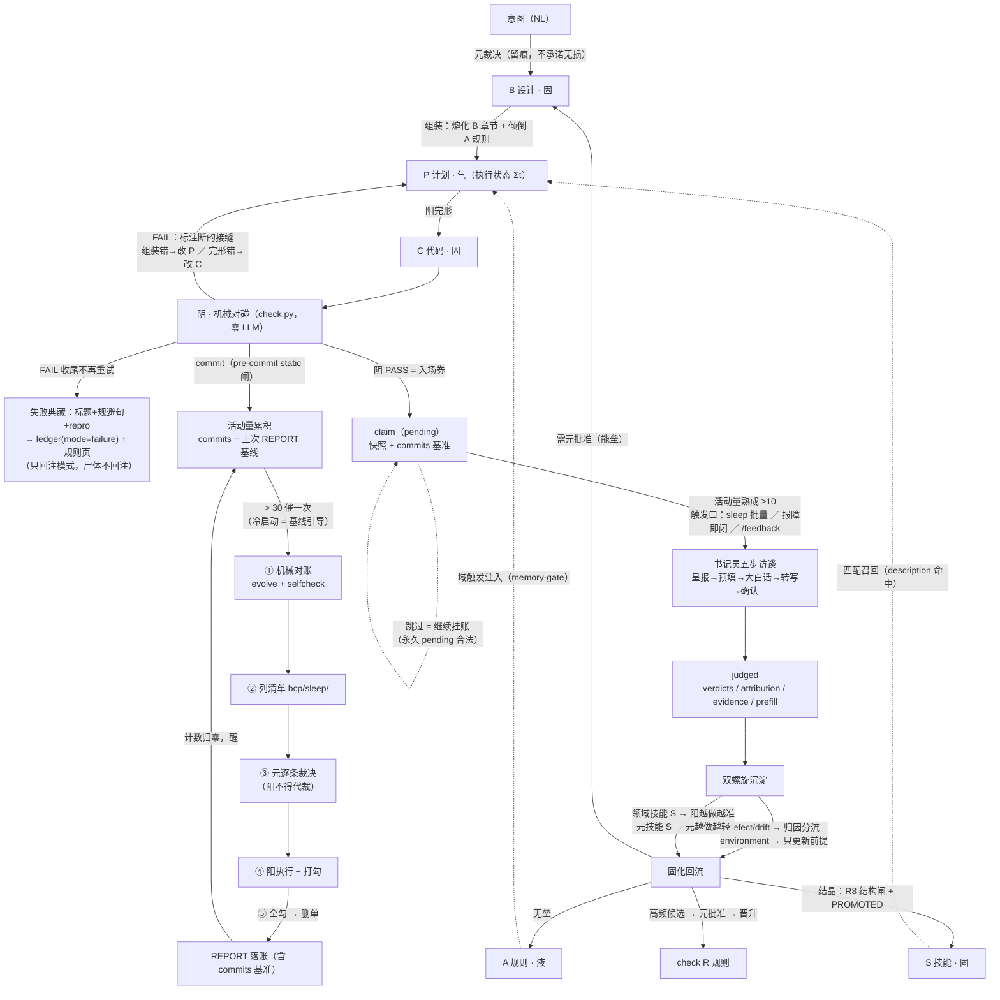
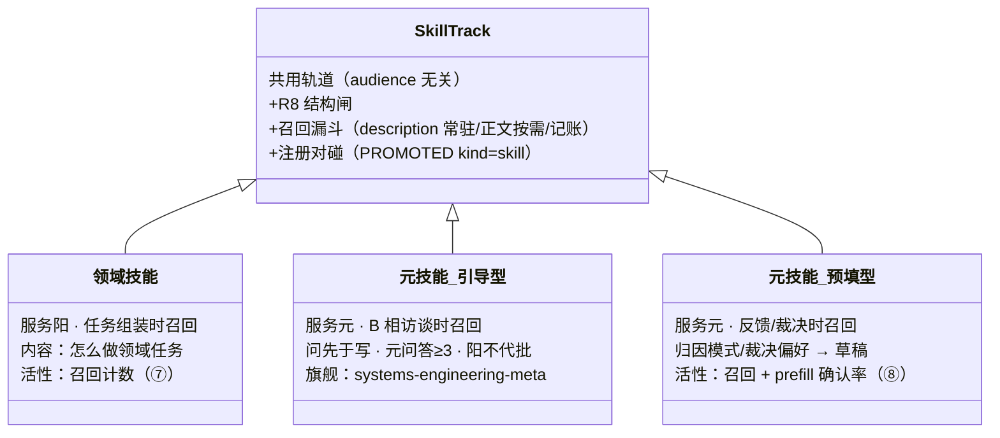
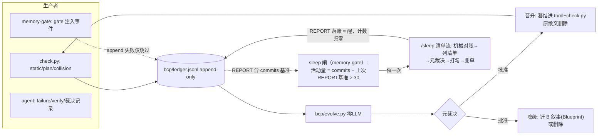
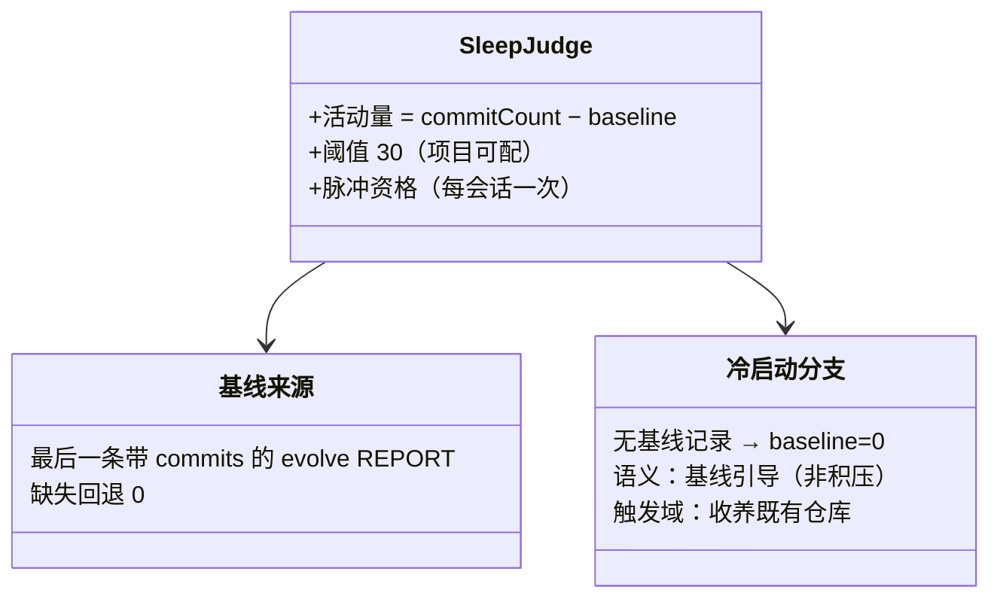
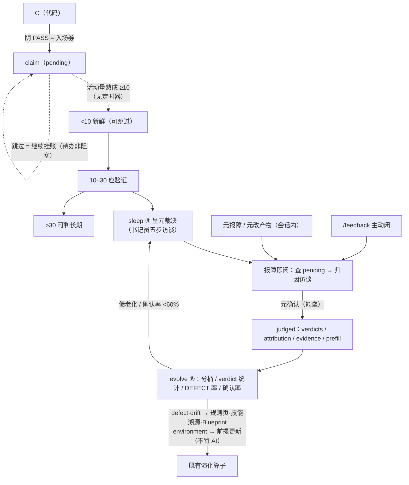
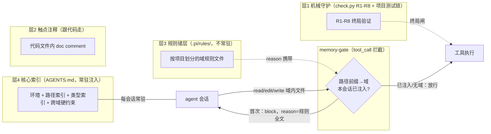
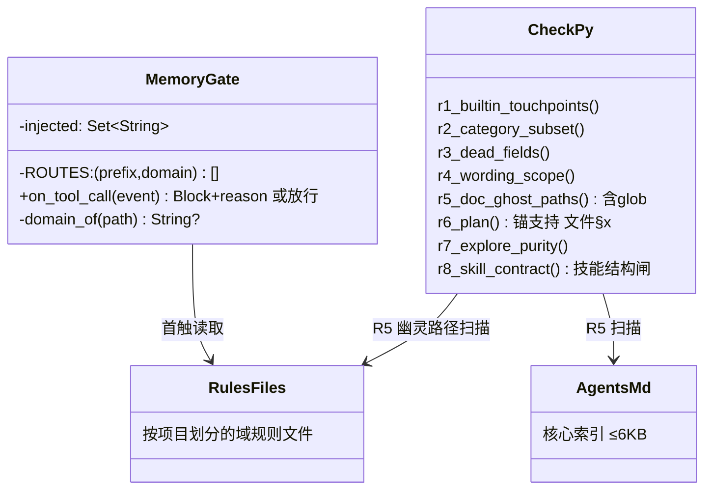

# BCP 范式蓝图（spec + 设计，B 相位）

> **分工**：`README.md` = 门面 + 导言（一句话/为什么/安装/入口，液态，外部受众）；本文件 = B 相位——范式 spec 与设计决定（边界/接口/约束/验收 + 机械契约），元批准后结晶，R6 计划锚点对象，R5 路径断言 = 设计承诺；`AGENTS.md` = 层4 核心索引（≤6KB）。分工细则见 §10。
> **变更工作流（范式变更必经）**：/bcp 设计（两图 + 章节编号）→ 先落本章 → /plan 锚引用 `§x.y` → 实施 → `/check` 对碰 → 回写本章。README 门面变更无需能垒（液态）。
> 本文件受 R5 引用完整性断言（bcp.toml docs）。

**术语速记**：**BCP** = Blueprint Completion Protocol（蓝图完形协议）；**元** = 用户，做判断的人；**阳** = LLM，起草和产出；**阴** = 机械系统，验证和记账，零 LLM。**完形** = 阳把不完整的上下文补成完整产出；**对碰** = 阴拿声明和事实机械比对；**能垒** = 批准门（内容固化为正式资产须经元点头）。

---

## 1. 核心模型

### 1.1 三方与裁决权

开发这件事拆到底只有三方，分工由各自的本质能力决定，不随偏好改变：

| 方 | 是谁 | 能做什么 | 做不了什么 |
|---|---|---|---|
| 元（用户） | 人 | 定方向、批准设计、判断「好不好」 | 不在场时什么都做不了；领域判断无法压缩成规则 |
| 阳（LLM） | 语言模型 | 起草计划、写代码、写文档（完形） | 对自己的输出没有责任能力；同样输入可能不同输出 |
| 阴（符号系统） | 编译器、测试链、git、check.py、账本 | 确定性验证与记录 | 只能验「声明与事实一致」（自洽），永远不能验「现实中有没有用」（正确） |

两条裁决权规则：

1. **阳的概率输出必须被阴的确定性裁决覆盖。** 凡「阳自己检查自己」都是作弊：产出者和检查者是同一个概率系统，共有盲区检查不出来——错的产出倾向于获得错的通过。
2. **元只在阴裁决不了的地方出手**（设计取舍、候选采纳）。阴管自洽，元管好不好，互不越权。

推论一：阴的 PASS 只是自洽的证明，不是质量的证明——所以正确性必须另找验证轴（§6）。
推论二（双轨原则）：阴的 FAIL 不可被元翻案（元反馈独立入账）；阴的 PASS 可被元标记「实际不可用」（claim/judged 闭环，§6）。verify 记录用 `state` 两态而非 `verdict` 字段，就是轨道分离在 schema 上的表达。

编码域的阴大部分现成——编译器和测试链就是天然的阴，BCP 在编码域只补两条接缝：计划与实现的对账（check.py）、注入与回流的记账（ledger.jsonl）。给自带裁判器的域强上完整循环是反模式（§9）。

### 1.2 三段转化链与工作流总图

意图直接映射到代码是一对多、不可校验的：同一句「加个恢复机制」对应十种实现，没有机械办法检查「代码是否符合那句话」。全局不可检。

插入两个中间对象拆成三段：`意图 →(元裁决)→ B（设计）→(组装)→ P（计划）→(阳完形)→ C（代码）`，每段单独可检：B 是不是用户要的（元裁决，只承诺留痕）；P 是否引用真实设计章节（阴查锚）；C 是否恰好填满 P 声明的空格（阴对碰，双向）。分段可检、误差逐段可归因——哪段错打回哪段，错误不在段落间漂移。

#### 工作流总图（全节点）

### 1.3 相变与对象模型

智能运行的物质条件是上下文窗口：容量有限，所以「此刻在想什么」（窗口内）与「已经存在什么」（窗口外）之间的流动必须是有序决策。相变模型给这套流动一套显式词汇：

| 相 | 在哪 | 是什么 | 流动规则 |
|---|---|---|---|
| **气** | 窗口内 | 会话上下文 | 任务结束即消散——消散是特性：旧任务的上下文形状留在新任务里会污染新补全 |
| **液** | 窗口外，可整体倾倒 | 规则与经验储层 | 按需注入窗口（闸门控制），在窗外持续演化 |
| **固** | 窗口外，检索式 | 仓库事实（代码、设计文档、技能、账本） | 只检索所需片段，永不整体进窗口 |

| 对象 | 相态 | 受众 | 生命周期纪律 |
|---|---|---|---|
| P 计划 | **气·瞬态内容物** | agent | 注入→完形→删除；成功即消散；失败压缩为失败模式典藏；尸体可留档审计，**不得回注后续容器** |
| A 规则内核 | **液**（储层） | agent | 持续形变（汇流/晋升/降级）；按需倾倒；受墙约束（§7.5） |
| S 技能 | **固·凝固的液体** | agent+元 | 从液态经验/裸跑轨迹结晶，带适用条件+操作程序+验证凭证+溯源；检索式召回（§3） |
| B 设计文档 | **固**（晶体） | 人类 | 入库需元批准（§1.5 能垒）；按需检索，不常驻 |
| C 代码 | **固**（晶体） | 机器+agent | 唯一实现事实；接口与类型的最终仲裁 |

三条纪律的依据：**相态判据是形变方式**——A 每次会话被注入但本体在窗外被持续重塑（液体）；B/C 只在越垒时相变（晶体）。**派生文档不允许原创事实**——每条事实性断言必须可溯源到代码或 B，双写没有同步机制时腐烂只是时间问题。**失败只留模式不留尸体**——模式是规则（可回注），尸体是过程上下文（禁回注）；失败模式比成功模式更有进化价值。

### 1.4 元的负荷

判据：**这件事，一个完全不懂该领域的聪明人，能不能替元做？** 能 → 不该推给元（记忆维护、时序管理、格式转换、重复确认——机械化或书记员代劳）；不能 → 必须元承担（意图、设计批准、反馈、归因、演化取舍）。

设计目标：**元的认知负荷 100% 花在领域判断上，0% 花在操作员工作上。** 时点检验：冷启动之后，元若还在想「缺陷归哪层」「规则该不该晋升」，沉淀失败；只想「这在领域上对不对」「产出实际效果好不好」，沉淀成功。

### 1.5 能垒保真

能垒（批准门）自身会退化：批准次数一多，每次批准变浅——橡皮图章式静默失效。范式部署一族机械探针：

| 探针 | 作用于 | 形态 |
|---|---|---|
| evidence 字段 | 裁决记录（PROMOTED/REJECTED/judged） | 批准所据 diff 概览/决策 ID，缺失进 evolve ⑧ 审计 |
| ≥3 领域问答 | 元技能·引导型的设计草稿 | 对话证据落盘为「元问答」节，grep 可查 |
| prefill 确认率 | 元技能·预填型 | judged.prefill={skill,agree}，低于 60% 呈降级候选 |
| 裁决史交叉 | 晋升/降级候选 | `[已裁决:REJECTED——勿重复提案]` 行内标注 |

共同原则：**翻译权在阳，裁决权在元**——阳可以起草一切，不能代替确认任何；元确认前的一切草稿不落账、不入统计。

---

## 2. 工作流协议

### 2.1 转化链与接缝

| 接缝 | 检查类型 | 范式承诺 |
|---|---|---|
| 意图→B | 不可机械校验（设计主权，分布外） | 只承诺留痕（B 记录设计决定），不承诺无损 |
| B→P | 引用解析（覆盖检查待做，§8.2） | P 的 blueprint 锚必须落进 B 实际章节 |
| P→C | 声明对碰 + accept 判据 | C 恰好填满 P 的空格，双向（做了没声明 / 声明了没做） |
| C→A/B | 回流弱信号（warn 级，待做，§8.2） | 检测「该回流未回流」的信号，不阻断 |

### 2.2 四阶段

| 阶段 | 职责 | LLM 触点 |
|---|---|---|
| 组装 | 读 B 相关章节 + A 倾倒样本 + 代码索引对账 → 产出 P | 起草 P 内容（schema 由协议定，模型填空不定义空格） |
| 阳完形 | 消费 P + A 内核产出代码，accept 即空格填满 | 完形 C |
| 阴对碰 | 机械对碰产出裁决与账本记录（§4） | **零 LLM** |
| 固化回流 | 避坑→A（无垒）、设计→B（需批准）、事实→C（§5） | 零 LLM（候选可由 LLM 起草，采纳是元的） |

### 2.3 双模注入（探索裸跑 / 生产先验）

| 模式 | 计划标记 | 组装纪律 |
|---|---|---|
| **探索**（技能进化 / 轨迹采集类任务） | `mode: explore` | **空上下文注入**：不读储层、不给案例召回，只给环境工具——阳在裸跑中犯错，产出高纯度原始轨迹 |
| **生产**（推理类任务，缺省） | `mode: infer` | 恢复默认注入：UCB top-K + 案例召回，用储层加速决策 |

依据：提前注入知识库会让阳走捷径、轨迹贬值（消融 -2.8%）——技能进化的原料必须是裸跑轨迹。

- **机械面（R7）**：计划头 `mode` 字段必检——产出 `SKILL.md` 或标记 `skill_evolution: true` 的任务必须 `mode: explore`，否则 FAIL。运行时注入行为静态不可检，由计划声明 + 账本审计兜底。
- **纪律钩子**：探索任务的组装禁止检索 `.pi/rules/` 与归藏资产（工作流内核 §2）。

---

## 3. 技能契约与双螺旋

### 3.1 技能契约

- **默认产物 = 文本单轨**：`deliverables/<name>/SKILL.md`（纯文本规则 + Frontmatter 元数据）；结构化自声明为候选扩展，未实现不强制。依据：纯文本 Markdown 规则平均 +17~24% 且跨模型迁移好；强制编译 Python 的工程成本在绝大多数场景 ROI 为负。
- **编译可选**：Python 固化仅在 ① 人类显式 `--compile-python`（待做，§8.2），或 ② 文本规则验证集成功率 ≥95% 时触发一次；其余场景文本即技能。文本技能走 prompt 注入轨道，不是机械执行体。
- **机械衔接**：① 结构闸 **R8**（check.py）——SKILL.md 必须带 frontmatter 三件套（`name`/`description`/`validation`）+「适用条件」节 +「溯源」节，无结构不结晶（无目录静默跳过）；② 召回挂载——pi 宿主在 `.pi/settings.json` 挂 `../deliverables`（description 一行常驻系统提示、正文按需读）；③ 召回记账——memory-gate 对读正文追加 `kind=skill-recall` 事件，evolve ⑦ 节统计（召回=0 = 死重候选）；④ **注册对碰**——注册凭证 = ledger `PROMOTED` 裁决记录（`kind:"skill"`, `target`=技能名）；⑦ 节双向对碰：有目录无记录=绕能垒结晶，有记录无目录=幽灵注册。
- **两类元技能**（同一轨道，差异在服务对象）：**引导型**——操作程序指导阳**向元提问**而非自行施工，产物 = 设计草稿 Blueprint.draft.md（边界/接口/约束/验收四段 + 元问答≥3），元批准后并入 Blueprint 落章节编号（旗舰示例 systems-engineering-meta）；**预填型**——元的归因模式/裁决偏好预填为草稿，只预填不代填，活性 = 召回计数 + 确认率（judged `prefill` 字段，⑧ 节聚合，持续偏低呈降级候选）。

### 3.2 双螺旋

技能轨道若只服务阳（领域技能让阳越做越准），元就永远是系统操作员——必须懂架构、懂归因、懂接缝，门槛变成「领域专家 + Agent 架构师」双重身份。第二股螺旋回答：**元的操作员知识能否像阳的领域经验一样被结晶、召回、演化？** 能——且几乎零新基础设施，因为技能轨道从头就是受众无关的（R8 结构闸、召回漏斗、注册对碰、活性统计不关心技能服务谁）。

- **领域技能**：服务阳，任务组装时召回，内容 = 怎么做领域任务。阳越做越准。
- **元技能**：服务元，反馈访谈/裁决呈报时召回，内容 = 元的归因模式/裁决偏好/流程程序性知识。元越做越轻。

两股共用同一生命周期：结晶经能垒（元批准 + ledger PROMOTED）、召回走同一漏斗、活性同受 evolve 监控（召回=0 死重候选；确认率 <60% 降级候选）。**元技能只预填不代填**——草稿生成器，不是决策替代器。冷启动纪律：零元技能是常态——没有确认数据就不结晶。

### 3.3 元技能·引导型

方向反转：普通技能指导阳做事，引导型指导阳**向元提问**。解决的问题：领域专家的门槛往往不是「不会写设计」，而是不熟悉系统工程方法论（边界/接口/约束/验收怎么划）。解法：方法论外包给阳，元只做他本能擅长的事——判断领域后果的翻译（「选 X → 好处 A，代价 B」）是否符合直觉。**门槛转移：领域专家不需要懂系统工程，只需要判断翻译对不对。**

三条硬纪律：**问先于写**（禁止一次性生成完整草稿求确认——橡皮图章的前置形态）；**元问答 ≥3 落盘**（对话证据变 grep 可查工件，事后可审计）；**阳不得代批**（能垒不变）。

### 3.4 元技能·预填型

内容 = 元的裁决偏好与归因模式。两个来源：**行为观察**——模式库就是账本本身，书记员访谈时机械过滤既往 judged 记录（按 route/files/anchor 键），预填时引用（「你过去 3 次对含 gating 文件的缺陷都归因 design，本次预填 design」）；**显式教学**——元说「以后 X 按 Y」，书记员当场起草 SKILL.md 走结晶能垒，教学不散落对话（散落即失忆）。

活性双指标：skill-recall（访谈中读正文即记账）+ **确认率**（judged.prefill={skill,agree}，⑧ 聚合，<60% 呈降级候选）。自动化偏见的防护全部来自既有机制：只预填不代填、确认率监控、不进机械对碰（prompt 注入轨道天然是经验层）、元可随时否决（进入回炉）。

### 3.5 双螺旋部件图

---

## 4. 阴：机械对碰

### 4.1 对碰层与失败路由

| 对碰层 | 内容 | 失败路由 |
|---|---|---|
| 律令层 | 引用解析、声明对碰（双向）、发明检测（待做，§8.2） | 打回 P（重组装） |
| 原子判据 | accept 命令全绿 | 打回 C（重完形） |
| 经验层 | A 注入的软规则（待做，§8.2） | 不打回，记入账本 |

- **失败必须标注断的是哪个接缝**：组装错改计划，完形错改代码，两类错误两类打回，不混。
- **check 禁止 LLM judge**：对碰器只能是确定性程序（grep/AST/命令执行/diff）——概率验证概率 = 阳自查自证（§1.1）。

### 4.2 门控顺序与双轨

门控双保险，符号阀前置：① 经验阀——验证集分数上涨只产生**采纳候选**；② 符号阀——`check.py --collision` 的引用悬空类机械检查**一票否决**，验证集满分不抵消符号 FAIL。为什么统计分数不能进判据表：分数天然有噪声和偏置，放进判据表 = 概率性证据获得否决权，与「阴必须确定性」（§1.1）直接冲突。**软分数可以提效（决定候选优先级），不可以越权（进入通过/失败判据）。**

双轨验证原则（§1.1 推论二的协议化）：元反馈滞后但真实，元持有最终验证权——协议见 §6。

### 4.3 check.py 规则（R1–R8）

| 规则 | 查什么 | 状态 |
|---|---|---|
| R1 builtin-touchpoints | 工具执行体存在且全部注册点出现 | 项目按需（示例配置在 bcp.toml） |
| R2 category-subset | kind 集 ⊆ category 集 | 项目按需 |
| R3 dead-fields | 已废弃字段无消费点 | 项目按需 |
| R4 wording | 禁用措辞扫描 | 项目按需 |
| R5 doc-ghost-paths | 文档反引号里带扩展名的仓库路径 token 必须存在（防幽灵基建；无扩展名路径不在断言面） | 开箱即用 |
| R6 plan-collision | 计划锚引用真实章节 + accept 全绿 + git 双向对碰（files=修改/新建目标；删除验收走 accept：`test ! -f`） | 开箱即用 |
| R7 explore-purity | 产出 SKILL.md / skill_evolution 的任务必须 `mode: explore` | 开箱即用 |
| R8 skill-contract | `deliverables/*/SKILL.md` 结构：frontmatter 三件套（name/description/validation）+ 适用条件节 + 溯源节 | 开箱即用（无目录静默跳过） |

每条 FAIL 裁决自带修复方向：改代码 / 改文档 / 改计划（R6 按条目标注）。R1–R4 为项目专属结构性规则，未配置 = 设计内跳过；按 §7.4 分流审计归层，散文规则反复违反且可机械化时按 §5.4 晋升凝结。

**规则 id 不内嵌章节号**：id 只记 `R<n>-<名称>`（如 `R8-skill-contract`）——章节号随文档重构变化，内嵌会把历史账本里的旧 id 变成幽灵规则名，污染 evolve ①/⑤ 统计；可溯源靠 check.py 注释里的 § 引用与 §4.3 本表。

**开箱即用 ≠ 装完即安全**：R5 的保护范围 = docs 配置中文档的路径断言；R6 只在计划声明 blueprint 锚时对碰；R7 只在 files 含 SKILL.md 或 `skill_evolution: true` 时触发。空转的 check 比没有 check 更危险（虚假安全感）——装完先跑 `--selfcheck`。

### 4.4 `--selfcheck`（健康自检）

装完或换宿主后跑一次：报告各闸门依赖是否就绪。`IDLE` = 依赖缺失、闸门空转（形同虚设）；`OK` = 就绪。含 sleep 巡检节律项（活动量 x/30 commit，超阈 IDLE——跑 evolve.py 落账即重置；基线只认带 `commits` 的 evolve REPORT，账本无基线记录时提示为冷启动基线引导，§5.6）。退出码恒 0（报告非裁决）。

---

## 5. 固化回流与演化节律

### 5.1 能垒与演化算子

**元批准 = 结晶能垒**。设计入 B 需元裁决（晶体不自校正，错误设计污染此后所有检索）；避坑汇入 A 无垒（液体自校正，错规则会被演化算子冲掉）；经验规则律令化（凝结进 check）无需能垒——判据可机械验证，证据即凭证。

- **证据账本**：对碰器每次运行追加 `bcp/ledger.jsonl`（rule_id / severity / finding / 时间）。
- **晋升**：散文规则反复违反且可机械化 → 凝结为 check 规则（bcp.toml + check.py），从 A 内核删除原散文。
- **结晶**（液→固）：经验规则/裸跑轨迹反复被召回且验证有效 → 提炼为 SKILL.md 固态技能（带溯源与验证凭证）；有验证集时经验阀可自动门控（经验阀待做，§8.2），无验证集时走能垒。
- **降级**：长期零命中且未防过事故 → 迁入 B 叙事或删除。
- **回流协议**：任务终态固定产出 ≤3 条避坑候选（入 A，无垒）+ 0–1 条设计候选（入 B，需批准）。FAIL 任务额外强制产出一条失败模式（mode=failure 入账本 + 避坑入 A，字段见 §8.4）。

### 5.2 统一证据流

晋升/降级算子需要数据消费者，故约定一切证据统一落账，evolve 报告器消费，裁决权在元：

| 生产者 | mode | 内容 |
|---|---|---|
| check.py | static / plan / plan+collision | findings[rule,sev,msg]（详见 §8.4） |
| memory-gate | gate | 注入/召回事件（kind：domain 域注入 / big-read / compact-restore / skill-recall / sleep 节律）；append 失败仅跳过，绝不阻断工具执行 |
| evolve.py | evolve | 每次报告的审计痕迹（候选清单） |
| agent | failure / verify / evolve（裁决记录） | 失败典藏 {title, avoidance, domain, repro}、元反馈 claim/judged 两态（§6）、晋升裁决 PROMOTED/REJECTED（§5.4） |

**容量与生命周期**：append-only 永久保留（滚动 = 可篡改），`--window` 只是读取视图，存储全量；单条上界 findings 落账截断 top50、msg≤200 字符（全文在 stdout）；>5MB 再议冷归档。

### 5.3 evolve.py 报告器（零 LLM，纯标准库）

- 输入：`bcp/ledger.jsonl` + check.py 源中的规则名注册表（正则机械提取，不建副本）+ `.pi/rules/` 清单。
- 输出：纯文本报告八节（下表）。
- 参数：`--window N`（天，默认 30）、`--min-hits M`（默认 3）、`--ledger <path>`（默认 `bcp/ledger.jsonl`，测试可指向空账本验冷启动）。退出码恒 0（报告非裁决）。
- 每次运行追加 mode=evolve 审计记录（候选以 findings WARN 形式入账，含 `commits` 对账基准——sleep 触发判据的消费端，§5.6）。

| 节 | 内容 | 用途 |
|---|---|---|
| ① 规则命中 | 各 R 规则全历史/窗口内命中数、末次命中 | 高频违反 = 晋升候选（值得凝结为机械规则） |
| ② 域注入计数 | 各代码域规则被注入次数 | 记忆分层管道是否在干活 |
| ③ 降级候选 | 窗口内零命中的规则 | 长期没用上 = 可能该降级或删除 |
| ④ 死重候选 | 从未被注入的规则文件 | 冷启动期（无任何域注入事件）改列「待积累」，不作死重判定（§5.7） |
| ⑤ 强化证据 | 窗口内高频 FAIL 规则 | 同 ①，聚焦近期 |
| ⑥ 晋升裁决史 | 历次 PROMOTED/REJECTED 裁决记录 | 被拒候选勿重复提案 |
| ⑦ 技能资产 | deliverables/*/SKILL.md 清单 + 召回计数 | 召回=0 的技能是死重候选（结晶后没人用 = 该回炉或删除） |
| ⑧ 假设检验 | 失败典藏 repro 回放（仍失败 = 回归嫌疑）+ 裁决记录证据指针审计 + 元验证债（pending 活动量分桶 / verdict 统计 / DEFECT 率）+ 幽灵裁决·畸形呈报 + 预填确认率（元技能降级候选） | 范式→机械层过渡假设的机械传感器：规避句是假设，回放才成结论；缺 evidence = 能垒保真债；pending 积压 = 元验证债，只呈报不强制；确认率低 = 元技能降级候选 |

### 5.4 晋升与降级执行（守 §5.1）

- **晋升**：报告给出高频候选 → 元批准 → agent 执行（散文规则凝结进 `bcp/bcp.toml` + `bcp/check.py`，原散文从 rules 文件删除）→ `/check` 全绿即凭证，无额外能垒。
- **裁决落账**：晋升/结晶获批 / 被拒后追加一条 ledger 记录 `{mode:"evolve", verdict:"PROMOTED"|"REJECTED", target:"<规则名或技能名>", kind:"skill"（技能裁决必标，与规则晋升区分）, source:"<来源失败模式标题，可选>", note:"<原因>"}`——⑥ 节回放防重复提案 + ⑦ 节注册对碰（kind=skill 的 PROMOTED ↔ deliverables 目录），被拒候选不重复提案。
- **降级**：报告给出零命中/死重候选 → **必经元裁决**（「未防过事故」不可机械测；零命中的低频高害结构性规则如 R1–R4、R8 不宜自动降，配置见 `bcp/bcp.toml` 的 `demote.exempt_prefixes`）→ 批准后迁 B 叙事或删除。

### 5.5 传感器与报告器免疫

范式最脆弱处是从设计到机械实现的过渡层。共同根因：check 对碰「代码↔计划」，但没有任何东西对碰「spec 承诺↔机械层行为」——墙纪律 ≤1.5k token、召回宁可漏不可胀、渐进披露，全是无遥测的不变量。三传感器补此缺口（evolve ⑧）：

1. **失败典藏 repro 回放**：FAIL 任务强制带 repro（当轮失败命令，只读断言）；每轮重跑，仍失败 = 回归嫌疑。规则晋升 check.py 后每次提交被重放，规则页晋升后一次都不被重放——同一范式内两种资产验证强度不对称，回放拉平之。**规避句是假设，回放才成结论。**
2. **裁决证据指针**：evidence 必填，缺失进 ⑧ 审计（能垒保真，§1.5）。
3. **宿主行为契约 + 一致性向量**（§8.5）。

fail-open 律（规则缺失放行不死锁）的代价：一切异常都伪装成「规则缺失放行」——TypeScript 能加载 ≠ 行为正确。对策：改 gate 后必跑契约向量 + 真触发一次域触碰验证 INJECTED 落账（规则域模式 8）。

报告器免疫族（evolve 是唯一数据消费者，报告非裁决）：JSON 坏行跳过 → schema 坏行跳过 + 呈报（⑧ 畸形）→ 幽灵引用呈报（⑦ 幽灵注册 / ⑧ 幽灵裁决同构）→ 重复记录取 ts 最新。**报告器永不死亡、永不静默吞错、永不替裁决。** 账本是多年期 append-only 流，schema 漂移必然出现，坏 schema 必须「跳过 + 呈报」而非崩溃或静默混入。

**空数据分支同在免疫面内**：报告末段的候选聚合不得引用只在条件分支内初始化的变量——无 judged / 无 gate 记录时报告器仍须完整跑完并落账（2026-09-11 sleep 对账实测：无 judged 记录时 `by_skill` 未初始化 → 退出码 1、REPORT 未落账、巡检无法醒来）。

**报告器测试面**：`kit/evolve-smoke.test.py` 用 `--ledger` 沙盒跑四种账本形态（空 / 只有 pending / 畸形+幽灵+重复 judged / 正常 judged 低确认率），断言退出码 0 且 REPORT 落账，真账本永不触碰（规则域模式 3）。改 `bcp/evolve.py` 后必跑——免疫律的机械凭证（规则域模式 8）。

### 5.6 sleep 机制与命令（演化节律）

液态经验积压、储层熵增、工作流逃逸都依赖「有人记得跑巡检」——无 cron 环境靠自觉必然衰减。sleep 把巡检从自觉变成节律：**agent 干活的痕迹全部落在 git 历史上**——一个月不 commit 的仓库不需要巡检，一天 50 个 commit 的仓库等满一个月才巡检也荒谬。元反馈（§6）与晋升/降级裁决共用这一节律——**一切滞后的人裁决都挂载到 sleep，不为任何一种造定时器**。巡检的代价是显式支付的维护成本：对账即固化、打勾即归一化、落账即元觉知——把「记得维护」从自觉变成代谢。

- **触发（入睡）**：memory-gate 第 4 注入点（kind=sleep）——会话首调检查活动量判据 `当前 commit 数 − 基线 > 30`（**基线 = 账本中最后一条带 `commits` 的 evolve 记录**；PROMOTED/REJECTED 裁决记录无 `commits`，跳过回溯、不重置基线），超阈则 block 一次注入提醒（重发即放行，会话只催一次）。
- **冷启动 = 账本无基线记录**：真白板（非 git / commit ≤ 30）差值 ≤ 0 天然不触发；收养既有仓库（>30 commit + 无基线记录）触发一次**基线引导**——文案明说「尚无巡检记录，跑一次建立基线」（无基线记录时账本里没有 BCP 经验可积压，宣称积压是误报），跑 /sleep 落 REPORT 即校准。
- **执行（清单流，/sleep 命令）**：① 机械对账（evolve.py + selfcheck，零 LLM）→ ② 列清单落盘 `bcp/sleep/<date>-sleep.md`（每条 `- [ ]` 含来源+建议处置）→ ③ **呈元逐条裁决（能垒，阳不得代裁：PROMOTED/REJECTED/降级/删除/挂起）** → ④ 执行+打勾 → ⑤ 清单全勾 → 删清单（过程可丢，账本留痕）。
- **停止（睡醒）**：醒来 = 新的 evolve REPORT 记录落账（含 commits 对账基准）→ 判据自动归零。睡没睡、裁决了什么，全是账本上的行，不靠任何一方的自觉或记忆。

### 5.7 冷启动：域证据无效期（死重判定）

管道刚落地时账本 0 条域注入事件，死重判定会把全部规则文件误标「死重候选」——管道自己还没流动，不能据此判定储层死重。规则：**死重判定必须有管道活性证据**——账本无任何域注入事件（mode=gate 且 kind=domain）时，④ 节改列「待积累」，报告头标 `[冷启动]`；≥1 域有注入即常态。

set 语义红线：死重只用「从未注入」判定，禁用「注入计数低」推断——gate 每域每会话去重，计数天然低频，低计数 ≠ 死重。

命名辨析：本节是**域证据无效期**（规则储层维度），§5.6 是**活动量基线缺失**（睡眠节律维度）——判据、消费端、失效模式全不同，措辞须带限定语。

---

## 6. 滞后验证协议（元反馈）

### 6.1 为什么只能滞后 + 三条验证轴

机械检查在任务当天能做的只有自洽；「产出在现实中有没有用」依赖真实使用，天然晚于产出。滞后不是缺陷，是物理约束。设计任务因此不是消除滞后，而是把滞后验证从「靠元记得、靠 agent 恰好在场」变成「账上挂着」：未验证声明 = 显性化的信任债，像技术债一样可见、可老化、可批量清偿。

| 轴 | 裁决者 | 时机 | 检验什么 |
|---|---|---|---|
| 阴（check） | 机械 | 同步 | **自洽**：声明与机械事实一致 |
| repro 回放 | 机械 | 异步（每轮 evolve） | **存续**：旧修复是否仍防得住旧失败 |
| 元验证 | 元 | **滞后**（真实使用） | **正确**：产出到底好不好用 |

回放查「修复是否仍有效」（机械），元验证查「修复是否曾正确」（判断）——两个不同的失败面，缺一不可。

### 6.2 claim / judged 两态

- **claim（pending）**：任务阴 PASS 收尾时由阳落账——快照 goal/items/files/accept/anchors + `commits` 活动量基准。阴 PASS 是入场券不是完成态。
- **judged**：滞后经书记员访谈后落账——verdicts 逐项（verified/drift/defect）+ attribution 归因 + evidence 元实况 + route 沉淀路由。
- **两记录而非一记录两状态**：字段翻转需改写历史，违反 append-only；两记录 ref 引用让账本只增不改，**入账即已确认**（构造保证强于标志位）。
- **pending 永久合法**：待办标记非阻塞标记。元没说话 ≠ 默认没问题；pending 积压本身是信号（不重要 / 没在用 / 忘了），由 ⑧ 呈报最老 top-N。
- **分桶**：活动量距离 <10 新鲜 / 10–30 应验证 / >30 可判长期；sleep 只呈报不强制。为什么用活动量不用时间：BCP 无守护进程，定时器 = 为元反馈造 cron；元的真实节奏是「做了足够多的事之后回头看看」，commit 距离比墙钟更贴近；claim 落账时快照 `commits`，零新状态零新触发器。

### 6.3 书记员（五步 / 四纪律 / 三触发口）

元不会主动填表，书记员（阳）主动问、帮写、让元只做确认。五步：呈报（分桶优先级）→ 预填（claim 快照 + 验收锚）→ 大白话提问（「X 后来实际用过吗？哪里感觉不对？」——不问枚举值）→ 转写（结构化草案）→ 确认落账。

四条纪律：只预填不代填（元没说不对就是没说）；不推断元的意图；defect/drift 必暴露归因选项；不翻案机械裁决。

三个触发口：sleep 批量（主节奏）、报障即闭（元的抱怨是免费验证数据，不得流失）、`/feedback` 主动闭（元的控制权）。

### 6.4 归因层

defect/drift 必带 attribution，五层各走既有回流算子，不新造执行体：

| 层 | 回流 |
|---|---|
| design | Blueprint 回写候选（防副本腐烂） |
| plan / implementation | 失败模式 → 规则页 / 技能溯源 |
| environment | 只更新前提，**不罚 AI**（「半年前对的，现在数据格式变了」不是阳的错，不得混入负反馈统计） |
| requirement | 回 B 相位重新设计（即元技能·引导型的入口） |

### 6.5 设计总装图

---

## 7. 记忆分层与上下文预算

### 7.1 四层（按可靠性降序）

| 层 | 机制 | 触发方式 | 腐烂面 |
|---|---|---|---|
| 1 凝结 | 规则 → check.py R 规则 / 项目测试链 | 违反即红，零阅读依赖 | 无（跟代码走） |
| 2 触点注释 | 单文件局部规则 → 代码触点 doc comment | 改代码必读文件，任务本身即触发 | 无（删代码即删规则） |
| 3 机械注入 | 跨模块规则 → `.pi/rules/<域>.md` + memory-gate 扩展 | `tool_call` 按文件路径前缀拦截，首次触碰域 → block + reason 携带规则全文，重试即带规则执行 | 每规则单一来源；R5 扫幽灵路径 |
| 4 核心索引 | AGENTS.md 只留环境信息 + 路径索引 + 类型索引 + 跨域硬约束，≤6KB | 每会话常驻 | 路径由 R5 守护 |

三个前提推出分层：① pi 无跨会话记忆，上下文文件即记忆——不写下来下次会话就不知道；② 巨型 AGENTS.md 全量常驻违反墙纪律——每会话为全部历史买单，即使本任务只用 5%；③ 「嵌套文件 + 自觉 read」= 纪律依赖——靠 agent 记得去读，与靠人记得更新文档同型失败（§9）。每条规则必须落一层，不允许无主散文。排序逻辑：违反即红的机械规则最可信（跟代码走）；要求 agent 每次记住的软规则最不可信（会忘）——**把最需要可靠的东西放在最不依赖记忆的层**。

### 7.2 注入闸门纪律与召回漏斗

- 拦截仅作用于 read/edit/write 三工具的 path 参数；bash 是已知缺口（改代码主路径是 edit/write，残余风险归项目 AGENTS.md 既有坏习惯条款）。
- 规则文件缺失 fail-open 放行 + notify（不能死锁）；会话内每域只拦一次（Set 去重）。
- 拦截时机在工具执行**前**：被拦调用不落盘，规则先落上下文，重试才执行——无「已执行才收到规则」窗口。
- **召回漏斗原则**：写入永远允许，召回严格设闸；宁可漏不可胀；人工显式入口兜底。沉淀与召回成本不对称：写入异步便宜，召回是每次会话都付的税。宁可漏不可胀的账：漏 = 重复踩一次坑（一次性损失，事后可补沉淀）；胀 = 每次会话变贵变钝（常驻越多，agent 对每条的平均注意力越薄，持续复利损失）。知识按常驻成本分层：常驻索引（层4，≤6KB）→ 域触发（层3，首触注入）→ 匹配召回（技能 description 命中才读正文）→ 冷储（不注册，grep 才见）。

### 7.3 规则文件组织与写作纪律

- **模式页**：每条规则 = 问题 + 根因 + 证据 + 规避句（10–30 行），文件头一行式目录（问题+根因+修复一句话）——召回时看目录判断相关性，不整读全文（渐进披露）。规则页注「来源」（源自哪条失败模式 / 哪次任务）。
- **写作纪律**：记「何时适用、为什么错」，不记低层操作技巧——低层 workaround 绑定特定模型版本的行为怪癖，模型升级后不仅失效还会把新模型拖差（跨模型负迁移：小模型习得的单行技巧把强模型 50.5% 拖到 18.1%）。条件与根因不随模型变：**错的原因比对的姿势耐用**。

### 7.4 分流审计（方法）

存量规则（AGENTS.md 散文 / 旧实例层）的清点工具：逐节判定「作用域（单文件/跨文件/全局）× 可机械化性」，按 §7.1 四层对号入座——单文件局部规则落层2 触点；跨域硬约束留层4；跨模块软规则落层3 储层（按代码路径域分文件）；可机械验证者凝结层1 check 规则，prose 收一行指针。审计产出即分流表，后续新增规则按同判据归层。

### 7.5 墙纪律（上下文预算）

- A 内核 ≤ ~1.5k token；嵌套规则文件 = 按需倾倒（**墙管注入样本的体积，不管储层总量**——储层躺在磁盘上不花钱，进窗口才花钱，限制点放在收费处）；B 允许大（检索式读取，不随请求加载）。
- **压缩纪律**：compaction 摘要只当导航，恢复后一切进度以计划文件勾选为准——摘要是有损压缩，结构化状态被压成散文后不可恢复（滑窗截断 0.18 / 统计压缩 0.22 vs 结构化状态 0.94）。
- **先凝结后收缩**：A 减肥之前，可机械化的规则必须先凝结进 check。顺序反了 = 规则直接丢失——没有机械兜底的软规则删掉就没了。

### 7.6 记忆分层总装图

### 7.7 记忆分层部件图

---

## 8. 宿主边界与使用

### 8.1 适用边界

| 适用 | 不适用 |
|------|-------|
| 需求模糊、无现成测试、LLM 需独立完成多轮迭代的域 | 有完整 CI/CD + 测试覆盖的成熟代码库（自带裁判器） |
| 人只给设计、无法逐行 review 的场景 | 人可实时结对 / 逐行 review 的场景 |
| 需要跨会话、跨模型、跨人员的经验累积 | 一次性脚本、探索性原型 |

装错域 = 给自带裁判器的域上重机制，白付对碰税；编码域只取 BCP 的接缝件（计划对账 + 记账）。前置门槛同构：领域专家不熟悉系统工程方法论不构成排除条件——元技能 `deliverables/systems-engineering-meta/SKILL.md` 把方法论外包给阳，元只裁决领域后果（§3）。

### 8.2 最小契约与两层结构

三文档（本文件 / `plan.md` 计划协议 / A 内核）+ 一个对碰器（`bcp/check.py`，规则外置 `bcp/bcp.toml`）+ 一条账本（`bcp/ledger.jsonl`）。对碰器只依赖 Python 3.11+ 标准库，随项目移植时复制 `bcp/` 与三文档协议即可。

| 层 | 件 | 归属 |
|---|---|---|
| 工具包 · **真宿主无关** | `README.md`（门面）· 本文件 · `plan.md` · `bcp/`（check.py / bcp.toml / evolve.py / ledger） · `deliverables/`（技能资产轨道，可选；自带旗舰示例 systems-engineering-meta，随包分发） | 复制到任何项目，只依赖 Python 3.11+ 标准库 |
| 工具包 · **pi 专属适配** | `.pi/`（APPEND_SYSTEM 工作流 + memory-gate 四闸门 + bcp-check + prompts） | **换宿主 = 必须重写等价的机械注入层**，否则 §7 四层记忆分层与墙纪律只落地一半 |
| 项目实例 | `AGENTS.md`（项目索引） · 项目自己的 `Blueprint.md`（可选设计文档） · `.pi/rules/*.md` · `bcp/plans/` | 各项目自养 |

`kit/` 为分发件（实例骨架 + pre-commit 模板 + 宿主行为契约与一致性向量 + 报告器冒烟），**不随项目复制**（防副本腐烂，§9）。

**未落地候选**（spec 承诺 vs 机械现状，按 §5.1 攒证据后凝结——当前无实现，不得据此假定已有闸门）：

| 承诺 | 文档位置 | 机械现状 |
|---|---|---|
| B→P 覆盖检查 | §2.1 | 仅锚解析（R6） |
| C→A/B 回流弱信号 | §2.1、§9 | 无 |
| 律令层发明检测 | §4.1 | 无 |
| 经验层软规则对碰 | §4.1 | 无（软规则只注入不裁决） |
| 经验阀（验证集自动门控） | §4.2、§5.1 | 无（仅 `--min-hits` 统计） |
| `--compile-python` 编译轨道 | §3.1 | 无（文本单轨即全部） |

### 8.3 机械闸门总表（零 LLM，不靠自觉）

| 闸门 | 触发 | 作用 |
|---|---|---|
| memory-gate 域注入 | 首次触碰 ROUTES 域文件 | block + 注入 `.pi/rules/<域>.md` 全文 |
| memory-gate 大文件附注 | read >20KB（每文件一次） | 提示先 grep 定位再 offset/limit 定点读 |
| memory-gate compaction 恢复 | `session_compact` 后首次工具调用 | 注入「重读计划文件」（计划 = 执行状态 Σt；摘要只当导航，状态以计划勾选为准，§7.5） |
| memory-gate skill-recall 记账 | read `deliverables/*/SKILL.md` 正文 | 纯记账不拦截（匹配召回 §7.2；⑦ 节活性统计） |
| memory-gate sleep 闸 | 活动量超阈（commits − 上次 REPORT 基准 > 30，每会话一次） | 催巡检：跑 /sleep 清单流（机械对账→元裁决→打勾→REPORT 落账即醒，§5.6） |
| /sleep 命令 | 手动（prompt 模板） | sleep 清单流五步：对账/列清单/呈元裁决/打勾/落账即醒 |
| /feedback 命令 | 手动（prompt 模板） | 元反馈书记员五步：呈报/预填/大白话/转写/确认落账（§6） |
| /check（R5–R8 通用，R1–R4 按需） | 手动或实现完成时 | 机械裁决，FAIL 带修复方向 |
| pre-commit | 每次 git commit | **只跑 static 规则集**（R5 等）；R6 计划对碰靠工作流中 /check 触发——失败留档的计划合法存在于 `bcp/plans/`，故提交闸门不跑 --plan（已知缝隙）。绕过 = `--no-verify`（人可见越轨） |
| evolve.py | 定期手动 | 晋升/降级候选数据，裁决权在元（§5.4） |

### 8.4 账本与术语速查（`bcp/ledger.jsonl`）

每行一条 JSON 记录，由符号系统自动追加（append-only，只增不改）。它是所有裁决的证据流，也是 `evolve.py` 报告的唯一数据源：

| 字段 | 含义 |
|---|---|
| `ts` | 时间戳 |
| `mode` | 谁写的 + 什么场景，见下表 |
| `verdict` | 结果：`PASS` / `FAIL`（check 裁决）；`INJECTED`（gate 注入成功）；`READ`（skill-recall 记账）；`FAIL_OPEN`（gate 规则文件缺失，放行不阻断）；`REPORT`（evolve 报告）；`PROMOTED` / `REJECTED`（evolve 裁决记录，⑥ 节回放防重复提案） |
| `fail` / `warn` | 本条记录中 FAIL / WARN 级发现的条数 |
| `findings` | 发现清单，每条 `{rule, sev, msg}`：`rule`=触发的规则名（见 §4.3），`sev`=FAIL 阻断 / WARN 提示，`msg`=内容与修复方向 |

| mode | 谁写 | 什么时候 |
|---|---|---|
| `static` | check.py | 不带 `--plan` 的静态扫描（pre-commit 提交闸门跑的就是这个） |
| `plan` | check.py | `--plan` 计划检查（含 accept 命令真实执行） |
| `plan+collision` | check.py | 再加 git 双向对碰：声明了没改 / 改了没声明，双向都 FAIL |
| `gate` | memory-gate 扩展 | 五种事件，看 `kind` 区分：`domain`（首次触碰某代码域，强制注入该域规则）；`big-read`（整读 >20KB 文件的定位提醒）；`compact-restore`（会话压缩后恢复进度提示）；`skill-recall`（读 SKILL.md 正文 = 技能被召回，纯记账不拦截）；`sleep`（活动量超阈，催一次巡检，§5.6） |
| `evolve` | evolve.py | 三种：**REPORT**=演化报告器运行的审计记录（本次产出哪些候选）；**PROMOTED / REJECTED**=晋升/结晶候选经人批准/拒绝后的裁决记录，字段见 §5.4——⑥ 节回放防重复提案；kind=skill 的 PROMOTED 同时是技能注册凭证，⑦ 节与 deliverables 目录双向对碰。**sleep 闸基线只认带 `commits` 的 REPORT**——裁决记录无该字段，不重置活动量计数（§5.6） |
| `failure` | agent 按协议追加 | 任务以 FAIL 收尾时的**失败典藏**：`{title, avoidance, domain, repro}` = 标题 + 规避句（≤200 字符）+ 所属域 + 当轮失败命令（只读断言，⑧ 节回放）。只留模式，不留过程——这是给后续任务回注的「别再踩」规则 |
| `verify` | agent 按元反馈协议追加 | 两态：**pending** = 任务 PASS 收尾时的待验证声明（`id`/`claim`/`items`/`files`/`accept` 快照/`anchors`/`commits` 活动量基准）——阴 PASS 是入场券非完成态；**judged** = 元滞后裁决（`ref`=claim id，`verdicts` 逐项 verified/drift/defect，`attribution` 归因层（environment 不罚 AI 只更新前提），`evidence` 必填，`route` 沉淀路由）。pending 可永久存在；⑧ 节活动量分桶呈报，sleep 只呈报不强制，`/feedback` 主动闭。可选 `prefill`={skill,agree} 预填确认记账（⑧ 确认率 / 降级候选） |

### 8.5 行为契约与一致性向量

最小契约（§8.2）只覆盖脚本草可移植；注入层的行为契约若只存在于 pi 适配层源码里，「换宿主 = 重写等价机械层」就无 spec 可对、等价性不可机械判（`--selfcheck` 只查依赖存在，不查行为一致）。

解法：`kit/host-contract.md` 把四闸门 + 召回记账的行为显式化（触发/动作/一次性语义/fail-open 律/优先级序/账本事件 schema/路径归一化），`kit/host-contract.test.py` 提供零 LLM 一致性向量集。移植者流程：目标宿主实现等价闸门 → 薄适配器喂同一向量集 → **全绿才算等价机械层**。

迁移 = 开源主入口：自用语境下迁移是「不轻易动的选项」；开源后每个采用者的默认路径就是迁移（他们全在不同宿主上）。因此行为契约优先级最高：**检验假设与旗舰交付物是同一件事**（契约 spec 同时服务采用者）。

### 8.6 宿主-被试主从定位

范式真源在宿主侧，专用内核仅作验证载体（反自指：观察一个自指系统需要另一个系统，成本不可控，故约定不自指）：

| 轨 | 承载 | 边界 |
|---|---|---|
| 范式真源（spec / A 内核 / 对碰器） | 宿主：提示词 + 零 LLM 脚本 | 改范式 = 改 Markdown，下次会话生效；专用内核跑范式 = 自带状态重建 + 每轮裁决的 token 税，属域错配（§9） |
| LLM 重层（递归分解、元认知） | 宿主 | 永不收进内核 |
| 机械层（check 规则、账本→证据流） | 可收进专用内核 | 只收零 LLM——便宜、可测、无观察者污染 |
| stage0 锚点 | pi | 范式失效时人工直修 spec，修完交回；自指系统需要外部不动点 |

**内核是被试/磨刀石**：价值在验证「递归分解 + 符号裁决 + 记忆分层」架构能否成立，不在替人管理开发。观察不需要自指——git + check + trace 已是观察；内核的失败喂养范式。

**自指门槛**：仅当内核瘦到「一次完整循环成本 ≈ 宿主一个会话」时重新评估。换宿主同理：仅当 ① 现宿主钩子无法机械化的关键编排需求，且 ② 测量确认价值 > 迁移成本时评估。

---

## 9. 反模式（范式预先排除的失败）

| 反模式 | 为什么致命 | 免疫 |
|---|---|---|
| SDD 膨胀（设计文档无限增长） | B 的价值在检索，无限增长摧毁检索效率；全量常驻违反墙纪律 | B 检索式不常驻 + 墙；章节编号 + 锚引用保持可检索 |
| 散文计划 | 散文无法机械对碰，「做完没有」全靠 agent 自述，损耗静默 | P 强制 schema（plan.md），check 按 schema 对碰 |
| LLM 自查自证 | 产出者与检查者是同一概率系统，共有盲区查不出来（§1.1） | 对碰器零 LLM（grep/AST/命令执行/diff） |
| 副本腐烂（事实多处存储） | 双写无同步机制时腐烂只是时间问题，且读者无法察觉 | 单一权威 + 引用可解析 + 派生文档不原创事实 |
| 纪律依赖（靠记忆更新文档/跑巡检） | 无监督的纪律必然静默衰减 | 回流协议 + sleep 节律（§5.6）+ 回流弱信号（待做，§8.2） |
| 过程上下文跨任务存活 | 旧空格形状污染新补全，agent 惯性沿用废弃方案 | P 成功即删；失败压缩为原子模式，尸体不回注 |
| 域错配（给自带裁判器的域上重机制） | 该域的阴已覆盖 BCP 补的接缝，白付对碰税；最小架构是域的函数 | 装前判域（§8.1）；编码域只取接缝件 |

---

## 10. 文档分层与写作纪律

### 10.1 README（门面）vs Blueprint（B 相位）vs AGENTS（层4）

| 维度 | README.md | Blueprint.md（本文件） | AGENTS.md |
|---|---|---|---|
| 相态 | **液**（随项目现状变化：改安装、修错别字、加徽章） | **固**（元批准后结晶；错误设计污染所有检索） | 液（索引随代码走） |
| 受众 | 外部：使用者、贡献者、路人 | 内部：元、阳、阴 | agent（每会话常驻） |
| 变更节律 | 高频、低门槛、非正式 | 低频、高门槛、需元批准（能垒） | 随代码结构演进 |
| 内容性质 | 门面、导言（定位/为什么/三方可读叙事）、安装、链接 | 设计决定、边界、接口、约束、验收 + 机械契约 | 环境 + 路径索引 + 类型索引 + 跨域硬约束，≤6KB |
| R5 影响 | 路径断言被扫，但多为安装路径 | 路径断言 = 设计承诺，每个都该被守护 | 路径由 R5 守护（层4 腐烂面） |
| R6 锚点 | 不会被 P 引用（无编号章节） | P 的 blueprint 锚必须落进实际章节 | 同 README |
| 写错的后果 | 改一版就行 | 污染此后所有检索 | agent 走错路 |

README 内容：① 一句话说清项目是什么；② 安装/运行的最短路径；③ 指向 Blueprint.md 的链接；④ 许可证、贡献方式；⑤ **导言层**（为什么、三方模型、机制概览、适用边界、愿景）——允许三方可读叙事，但其中的机制、流程、数字必须以本文件为准并**挂 § 指针**，不得承载机械契约（R 表、账本 schema、参数）与未落地状态，不得双写图表（指针指向本文件单一来源）。Blueprint 内容：系统边界与模块划分、关键接口与数据流、硬约束（性能/安全/成本）、验收标准（元可读的领域语言）+ 机械契约。**同一事实不双写**（防副本腐烂）；本文件不重复 README 的安装细节。

### 10.2 编号纪律

本文件章节号被机械件与跨文档引用硬编码（check.py / memory-gate / 宿主契约 / 系统提示词 / 计划锚）。**改编号 = 原子同步全部引用点**（grep 全仓核清后一次改齐）；新增内容优先追加新章，重排是最后手段。README 无编号章节，不作锚对象。

### 10.3 蓝图写作纪律

1. **术语首次出现必须给一句白话定义**——不许假设读者已读过其他文档。
2. **先讲问题再讲方案**——每个机制开头回答「没有它会坏在哪」。
3. **暗喻只做标题，正文必须展开成完整推理**——「同构」「相变」「能垒」不当论证用，只在定义之后作速记。
4. **每章必带图或表**——结构以 mermaid 总装图/部件图或表格呈现，散文只承载推理。
5. **只记确定设计**——不记沿革、被拒方案史、迁移史；设计依据只在承载结论处内联一句。
