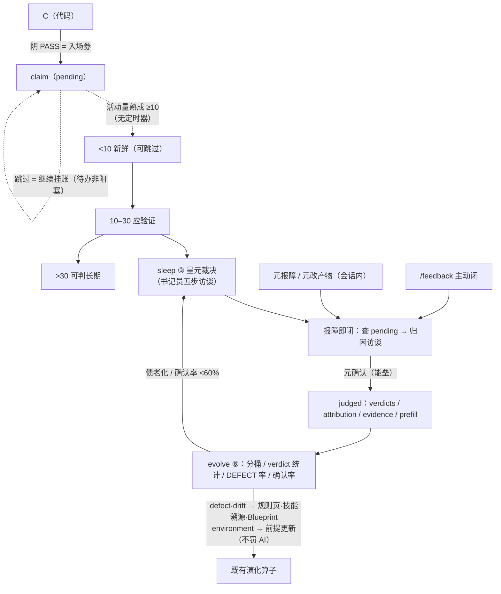

# BCP 范式蓝图（自举实例层 · 设计文档）

> **分工**：`README.md` = 范式 spec（是什么 / 怎么用 / 机械契约）；本文件 = 设计蓝图（为什么 / 取舍 / 被拒方案）。
> **变更工作流（范式变更必经，自举 BCP 工作流）**：/bcp 设计（两图 + 章节编号）→ 先落本章 → /plan 锚引用 `Blueprint.md§x.y` → 实施 → `/check` 对碰 → 回写本章。
> **沿革纪律**：新设计决定按章追加或修订；被拒方案一律入 §6 索引（与 evolve ⑥ 防重复提案同构）。本文件受 R5 引用完整性断言（bcp.toml docs）。

---

## 1. 三方裁决权与能垒

### 1.1 为什么最终验证权在元

BCP 的三方分工不是组织设计，是认识论分工：

- **元（领域专家）**持有唯一不可迁移的资产——领域判断。免疫学家知道门控策略对不对，临床物理师知道计划好不好，工业工程师知道控制逻辑现场稳不稳。这个判断依赖数十年的领域经验，没有替代品，也不能被压缩进任何规则系统。
- **阳（LLM）**是概率完形引擎：能起草、能翻译、能预填，但它的输出永远需要被验证——它对自己的输出没有责任能力。
- **阴（机械对碰）**是确定性裁决器：能验证「声明与机械事实一致」（自洽），永远不能验证「这个东西在现实中有没有用」（正确）。

由此得出范式最根本的裁决权分布：**领域判断归元，机械对碰归阴，完形与翻译归阳；三方互不越权。** 阴的 PASS 不是质量的证明，是自洽的证明——没有自相矛盾的声明不等于正确的产出。

### 1.2 元负荷三分法与「不懂领域者」判据

元在系统里的全部工作可按一个判据三分：

> **这件事，一个完全不懂该领域的聪明人，能不能替元做？**

- **能** → 不该推给元（机械化或书记员代劳）：记忆维护（记得 pending 有哪些）、时序管理（记得该给反馈了）、格式转换（填结构化字段）、重复确认（同候选反复呈报）。
- **不能** → 必须元承担，没有捷径：意图描述、设计批准、反馈「用了没/对不对」、归因取向、演化取舍。

设计目标因此可陈述为一条：**元的认知负荷 100% 花在领域判断上，0% 花在操作员工作上。** BCP 对元的要求不低——但「不低」必须全部来自复杂系统的固有难度（领域判断、滞后验证、演化裁决），不能来自设计未优化到位（记忆、格式、时序、重复）。衡量成败的时点检验：冷启动期之后，元若还在想「这个缺陷归哪层」「这条规则该不该晋升」，说明沉淀失败；元若只想「这在临床上对不对」「这个产出的实际效果好不好」，说明沉淀成功。

### 1.3 能垒保真：探针族

能垒（相变必须经过的批准门）自身会退化——频度上升导致每次批准变浅，橡皮图章梯度是静默失效。范式为此部署了一族探针，全部机械可查：

| 探针 | 作用于 | 形态 |
|---|---|---|
| evidence 字段 | 裁决记录（PROMOTED/REJECTED/judged） | 批准所据 diff 概览/决策 ID，缺失进 ⑧ 审计 |
| ≥3 领域问答 | 元技能·引导型的 B_draft | 对话证据落盘为「元问答」节，grep 可查 |
| prefill 确认率 | 元技能·预填型 | judged.prefill={skill,agree}，低于 60% 呈降级候选 |
| 裁决史交叉 | 晋升/降级候选 | `[已裁决:REJECTED@ts——勿重复提案]` 行内标注 |

共同原则：**翻译权在阳，裁决权在元**——阳可以起草一切，不能代替确认任何；元确认前的一切草稿不落账、不入统计。

### 1.4 双轨原则

阴与元是两条独立轨道，互不覆盖：阴的 FAIL 不可被元翻案（「我觉得行」只能作为元反馈入账，机械裁决独立成立）；阴的 PASS 可被元标记为「实际不可用」（claim/judged 闭环，§2）。verify 记录用 `state` 两态而非 `verdict` 字段，正是轨道分离的 schema 表达。

---

## 2. 滞后验证协议（元反馈）

### 2.1 问题：正确性只能滞后供证

机械检查在 T+0 可做的只有自洽（声明↔事实对碰）。而「产出在现实中有没有用」依赖真实使用——用户不可能在工具跑完当天知道门控策略在全部样本类型上对不对。**滞后不是系统缺陷，是现实的物理约束：对真实使用验证，天然晚于产出。** 设计任务因此是把滞后验证从「靠元记得、靠 agent 恰好在场」变成「账上挂着」——未验证声明 = 显性化的信任债，像技术债一样可见、可老化、可批量清偿。

### 2.2 三条验证轴

| 轴 | 裁决者 | 时机 | 检验什么 |
|---|---|---|---|
| 阴（check） | 机械 | 同步 | **自洽**：声明与机械事实一致 |
| repro 回放 | 机械 | 异步（每轮 evolve） | **存续**：旧修复是否仍防得住旧失败 |
| 元验证 | 元 | **滞后**（真实使用） | **正确**：产出到底好不好用 |

三轴互补：回放查「修复是否仍有效」（机械），元验证查「修复是否曾正确」（判断）——两个不同的失败面。

### 2.3 claim/judged 两态与 append-only 律

- **claim（pending）**：任务阴 PASS 收尾时由阳落账——快照 goal/items/files/accept/anchors + `commits` 活动量基准。阴 PASS 是入场券，不是完成态；claim 即「待元验证队列」的数据形态。
- **judged**：滞后经书记员访谈后落账——verdicts 逐项（verified/drift/defect）+ attribution 归因 + evidence 元实况 + route 沉淀路由。
- **为什么两记录而非一记录两状态**：`agent_draft→meta_confirmed` 字段翻转需要改写历史，违反 append-only 法律；两记录引用（ref 对账）让账本只增不改，草稿只活在对话里，**入账即已确认**（构造保证强于标志位）。
- **pending 永久合法**：它是待办标记不是阻塞标记——可永久存在、不自动 verified、不阻塞任何执行路径。元没说话 ≠ 默认没问题；pending 积压本身是信号（不重要 / 没在用 / 忘了），由 ⑧ 呈报最老 top-N。

### 2.4 活动量分桶：为什么不是时间

早期设计用 T+1/T+7/T+30 时间档 + 定时询问（24h/7d/30d 主动问）。被否决，三层理由：

1. **架构**：BCP 无守护进程，定时器 = 为元反馈造 cron——与「元 Agent」同型错误（为能力造进程/角色，而非把数据挂载到既有节律）。sleep 本来就是活动量触发的批量对账节律，元反馈天然是它的代谢产物。
2. **语义**：元的真实节奏不是「过了 7 天该给反馈」，而是「做了足够多的事之后，自然回头看看之前的产出」。活动量（commit 距离）比墙钟更贴近这个节奏。
3. **机械**：claim 落账时快照 `commits` 基准（与 evolve REPORT 的 commits 字段同模式），距离 = 当前 − 基准，零新状态、零新触发器。

分桶：<10 新鲜（可跳过）/ 10–30 应验证 / >30 可判长期。**sleep 只呈报不强制**——元可跳过任何条目，跳过即保持 pending，不阻塞醒来。

### 2.5 书记员而非代言人

元不会主动填表，Agent 必须主动问、帮写、让元只做确认。五步：呈报（pending 分桶优先级）→ 预填（claim 快照 + Blueprint 验收锚）→ 大白话提问（「X 后来实际用过吗？哪里感觉不对？」——不问枚举值）→ 转写（结构化草案）→ 确认落账。四条纪律：**只预填不代填**（元没说不对就是没说）；**不推断元的意图**；**defect/drift 必暴露归因选项**（元没归因就问）；**不翻案机械裁决**。三个触发口：sleep 批量（主节奏）、报障即闭（元的抱怨是免费的验证数据，不得流失）、`/feedback` 主动闭（元的控制权）。

### 2.6 归因层：定位到接缝

defect/drift 必带 attribution，五层各走既有回流算子，**不新造执行体**：

| 层 | 回流 |
|---|---|
| design | Blueprint 回写候选（防副本腐烂） |
| plan / implementation | 失败模式 → 规则页 / 技能溯源 |
| environment | 只更新前提，**不罚 AI**（「半年前对的，现在数据格式变了」不是阳的错，不得混入负反馈统计） |
| requirement | 回 B 相位重新设计（即元技能·引导型的入口） |

### 2.7 健壮性：报告器免疫律（审查实证）

2026-09-11 沙盒审查以对抗记录打 ⑧ 节，抓出三缺陷并修复，沉淀为免疫律：

- **崩溃免疫**：畸形 verdicts（list 非 dict）曾使整个 evolve 崩溃——账本是多年期 append-only 流，schema 漂移必然出现；报告器对坏 schema 必须「跳过 + 呈报」（`[畸形]`），永不死亡。load_records 免 JSON 坏行是同一律的前半。
- **幽灵裁决**：judged ref 无对应 claim 曾静默混入统计——⑦ 有幽灵注册对碰，⑧ 补同构检查（`[幽灵裁决]` 呈报）。
- **重复裁决**：同 ref 多条 judged 曾双计使 DEFECT 率失真——append-only 不改历史，统计按 ts 取最新。

### 2.8 设计总装图

---

## 3. 技能双螺旋

### 3.1 单螺旋的缺陷

BCP §2.4 原技能轨道只服务一股螺旋：**领域技能让阳越做越准**。若只有这一股，元永远是「系统操作员」——必须懂 BCP 架构、懂归因层、懂接缝语义。准入门槛变成「领域专家 + Agent 架构师」双重身份，范式沦为学术玩具。第二股螺旋回答的问题是：**元的操作员知识能否像阳的领域经验一样被结晶、召回、演化？** 答案是能——而且几乎零新基础设施，因为 §2.4 轨道从头就是 audience 无关的（R8 结构闸 / 召回漏斗 / 注册对碰 / 活性统计不关心技能服务谁）。

### 3.2 双螺旋

- **领域技能**（原轨道）：服务阳，任务组装时召回，内容 = 怎么做领域任务。阳越做越准。
- **元技能**（变体）：服务元，反馈访谈/裁决呈报时召回，内容 = 元的归因模式/裁决偏好/流程程序性知识。元越做越轻。

两股共用同一生命周期：结晶经能垒（元批准 + ledger PROMOTED）、召回走同一漏斗（description 常驻 + 正文按需 + skill-recall 记账）、活性同受 evolve 监控（召回=0 死重候选；确认率 <60% 降级候选）。**元技能只能预填，不能代填**——它是草稿生成器，不是决策替代器；最终验证权永远在元。

### 3.3 元技能·引导型（旗舰：systems-engineering-meta）

方向反转：普通技能指导阳做事，引导型指导阳**向元提问**。解决的问题：领域专家的门槛不是「不会写设计」，而是「不熟悉系统工程方法论」（边界/接口/约束/验收怎么划）。解法是把方法论外包给阳，元只做他本能擅长的事——判断领域后果翻译（「选 X → 好处 A，代价 B」）是否符合直觉。操作程序九步，三条硬纪律：**问先于写**（禁止一次性生成完整草稿求确认——橡皮图章的前置形态）；**元问答 ≥3 落盘**（对话证据变 grep-able 工件，事后可审计）；**阳不得代批**（能垒不变）。产物 Blueprint.draft.md 四段（边界/接口/约束/验收）+ 预演冲突 ≥1；元批准后并入 Blueprint 落章节编号，下游计划以 `blueprint: §x.y` 锚引用，受 R6 悬空检查——**设计证据闭环进既有机械链，不加新 R 规则**。

### 3.4 元技能·预填型

内容 = 元的裁决偏好与归因模式。两个来源：

1. **行为观察**：v1 的模式库就是账本本身——书记员访谈时机械过滤既往 judged 记录（按 route/files/anchor 等已有键），预填时引用：「你过去 3 次对含 gating 文件的缺陷都归因 design，本次预填 design」。「同类缺陷」的语义泛化是书记员的事（LLM 引用历史），不是存储的 schema——机械模式检测器（同键重复 ≥K → 提结晶候选）推迟到确认数据积累后按 §4.2 攒证据。
2. **显式教学**：元说「以后 X 按 Y」——书记员当场起草 SKILL.md 走结晶能垒，**教学不散落对话**（散落即失忆）。

活性双指标：skill-recall（访谈中读正文即记账）+ **确认率**（judged.prefill={skill,agree}，元照单确认 = true、被修正 = false；evolve ⑧ 聚合，<60% 呈降级候选）。自动化偏见的防护全部来自既有机制：只预填不代填、确认率监控、不进机械对碰（prompt 注入轨道天然是经验层）、元可随时否决（进入回炉）。

### 3.5 门槛相变四阶段（叙事，非机制）

冷启动（第 1–4 周负荷最高，元懂全部）→ 模式积累（书记员引用历史预填，元从确认开始）→ 元技能结晶（高频模式经能垒固化，元退回领域判断者）→ 隐性知识显性化（「这种感觉不对」被追问为显式模式）。周数是描述不是机制——不建 stage 守护进程，阶段由数据自然驱动。**冷启动纪律：零元技能是常态**——没有确认数据就不结晶，第一个元技能必须等真实 judged 攒出来。

### 3.6 双螺旋部件图

---

## 4. 演化节律与传感器

### 4.1 sleep：代谢是 commit 不是墙钟

液态经验积压、储层熵增、工作流逃逸都依赖「有人记得跑巡检」——无 cron 的环境里靠自觉必然衰减。sleep 把巡检从自觉变成节律：**agent 的代谢是 commit，不是墙钟**。触发 = 活动量（当前 commit − 最后 REPORT 基准 > 30），每会话只催一次；执行 = 清单流五步（对账 → 列清单 → 呈元裁决 → 打勾 → REPORT 落账即醒）。元反馈（§2）与晋升/降级裁决共用这一节律——**一切滞后的人裁决都挂载到 sleep，不为任何一种造定时器**。

### 4.2 三传感器与共同根因

范式最脆弱处是从设计到机械实现的过渡层。共同根因：check 对碰「代码↔计划」，但没有任何东西对碰「README 承诺↔机械层行为」——墙纪律 ≤1.5k token、召回宁可漏不可胀、渐进披露，全是无遥测的不变量。三传感器补此缺口（evolve ⑧ 假设检验）：

1. **失败典藏 repro 回放**：FAIL 任务强制带 repro（当轮失败命令，只读断言）；每轮重跑，仍失败 = 回归嫌疑。规则晋升 check.py 后每次提交被重放，规则页晋升后一次都不被重放——同一范式内两种资产验证强度不对称，回放拉平之。**规避句是假设，回放才成结论。**
2. **裁决证据指针**：evidence 必填，缺失进 ⑧ 审计（能垒保真，§1.3）。
3. **宿主行为契约 + 一致性向量**（§5）。

### 4.3 fail-open 双刃剑（实证）

fail-open 律的代价：一切异常伪装成「规则缺失放行」。2026-09-11 契约抽取任务实证双缺陷：① 域注入读规则引用游离变量，异常被 catch 吞成 FAIL_OPEN——闸门①静默死亡，TypeScript 能加载 ≠ 行为正确；② skill-recall 正则无捕获组，target 静默丢失成假域。两者均无自然触发机会（召回=0 时缺陷不暴露）。教训沉淀为模式 8：**改 gate 后必跑契约向量 + 真触发一次域触碰验证 INJECTED 落账**。

### 4.4 报告器免疫律

evolve 是唯一数据消费者，报告非裁决（退出码恒 0）。免疫族：JSON 坏行跳过（load_records）→ schema 坏行跳过 + 呈报（⑧ 畸形）→ 幽灵引用呈报（⑦ 幽灵注册 / ⑧ 幽灵裁决同构）→ 重复记录取 ts 最新（verify judged / 晋升候选裁决史交叉标注同族）。**报告器永不死亡、永不静默吞错、永不替裁决。**

---

## 5. 宿主边界

### 5.1 最小契约的盲区

§8.1 最小契约只覆盖脚本草可移植（Python 3.11+ 标准库）——但注入层（记忆分层/墙纪律的宿主执行体）的行为契约原本只存在于 pi 适配层源码里，是隐式的。「换宿主 = 重写等价机械层」无 spec 可对、等价性不可机械判（`--selfcheck` 只查依赖存在，不查行为一致）。

### 5.2 行为契约与一致性向量

解法：`kit/host-contract.md` 把四闸门 + 召回记账的行为显式化（触发/动作/一次性语义/fail-open 律/优先级序/账本事件 schema/路径归一化），`kit/host-contract.test.py` 提供零 LLM 一致性向量集（14 条场景 + 参考实现）。移植者流程：目标宿主实现等价闸门 → 薄适配器喂同一向量集 → **全绿才算等价机械层**。抽取过程本身即捕获两只潜伏缺陷（§4.3）——契约显式化前此类静默死亡无传感器。

### 5.3 迁移 = 开源主入口

自用语境下迁移被触发条件锁成「不轻易动的选项」，定价诚实。但开源后每个采用者的默认路径就是迁移（他们全在不同宿主上）——届时迁移不是边缘案例，是主入口。因此行为契约的优先级最高：**检验假设与旗舰交付物是同一件事**（契约 spec 同时服务采用者）。

---

## 6. 已拒方案索引（防重复提案）

| 方案 | 拒因 | 复活条件 |
|---|---|---|
| 元 Agent（系统工程第三方角色） | 为能力造角色破坏三方模型；技能轨道可承载且可演化（§3.1） | 技能轨道被证明无法承载引导职责 |
| 定时器 / 守护进程（元反馈 T+1/T+7/T+30 主动询问） | 为能力造进程；sleep 活动量节律天然承载；元的节奏是活动量不是墙钟（§2.4） | 活动量触发被证明采样不足 |
| declaration.yaml 双轨产物 | 全仓零实现的幽灵基建（2026-09-11 清除），文本单轨足够 | 结构化自声明出现真实消费端 |
| 元反馈覆盖阴 quality 字段 + Beta 后验权重（α+1.5/β+2） | 账本无 quality 字段、无 Beta 机械（外部范式带入）；统计分数进不了判据表（README§3） | 计数统计在候选排序上失效且判据表需要软分数 |
| agent_draft→meta_confirmed 字段翻转 | 违反 append-only；两记录 ref 引用更强（入账即已确认，§2.3） | 无（append-only 是法律） |
| 隐式反馈全量承诺（转发/仓外重用自动记录） | 对 agent 不可见的信号 = 虚假传感器；只承诺可测的（修改/丢弃/重用） | 宿主提供产物使用事件钩子 |
| 时间分桶（T+7/T+30 档位） | 活动量分桶更贴 sleep 触发语义与元的真实节奏（§2.4） | 非 git 项目（活动量恒 0）成为主流场景 |
| 行为模式机械检测器（同键重复 ≥K 提结晶候选） | 「同类」的键控方案未定，v1 由书记员引用账本历史（账本即模式库） | 确认数据积累后按 §4.2 攒证据 |
| stage 周数阶段机制 | 四阶段是叙事不是机制，不建守护进程（§3.5） | 无 |
| 运行时文本技能类型 | 未拒——§8.2 待做候选（延迟非否决） | 出现运行时消费端 |

---

## 7. 实证与沿革记录（自 README spec 迁入）

> 设计证据集中存放（spec 只留规范句 + 指针）；后续设计证据一律落本章，不回填 README。

- **双模注入消融（README§2.3）**：执行类任务提前注入知识库会让阳走捷径，产出的轨迹对技能进化贬值——消融 -2.8%。据此：explore 任务空上下文组装，R7 机械裁决。
- **文本技能轨道（README§2.4）**：纯文本 Markdown 规则平均 +17~24% 且跨模型迁移好；强制编译 Python 的工程成本（编译耗时 / 冒烟压测）在绝大多数场景 ROI 为负。据此：文本单轨默认，编译仅显式 `--compile-python` 或验证集成功率 ≥95% 触发。
- **跨模型负迁移（README§5.5）**：小模型习得的单行技巧把强模型 50.5% 拖到 18.1%。据此：规则写作纪律——记条件与根因，不记低层 workaround。
- **压缩预算匹配（README§6）**：滑窗截断 0.18 / 统计压缩 0.22 vs 结构化状态 0.94。据此：compaction 摘要只当导航，状态以计划勾选为准（Σt 落盘）。
- **反自指约定（README§8.3）**：曾设想「专用内核既是开发范式又是被开发主体」（自指），约定不自指——范式真源在宿主侧，内核仅作验证载体；LLM 重层永留宿主，双轨只收零 LLM 机械层。
- **sleep 节律（README§4.7）**：完整论证见本蓝图 §4.1（首个成章设计动因，2026-09 从 README 迁入）。
