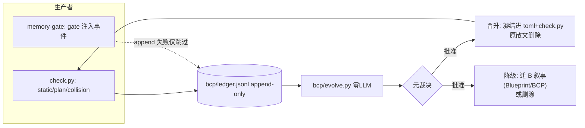
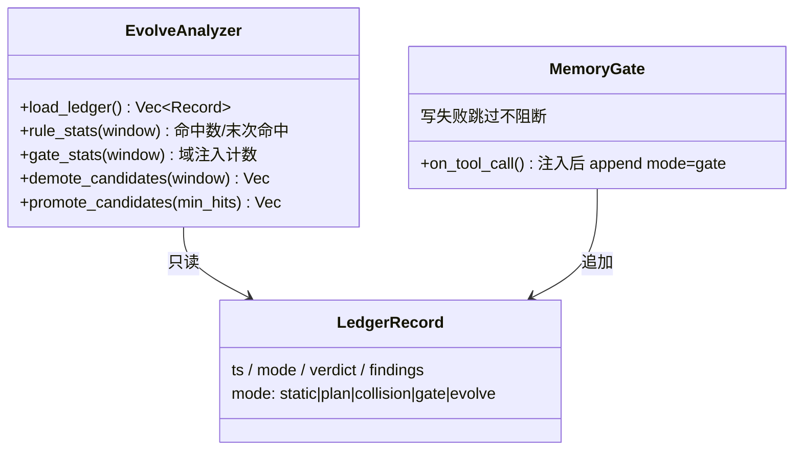
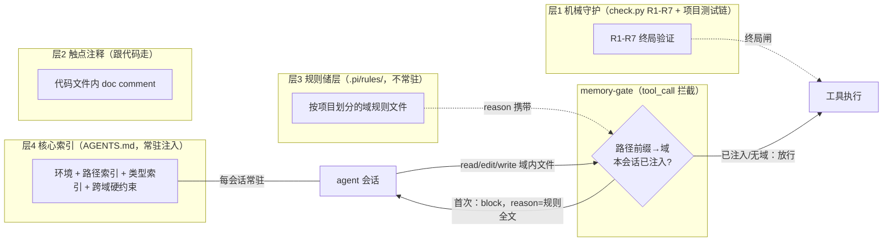
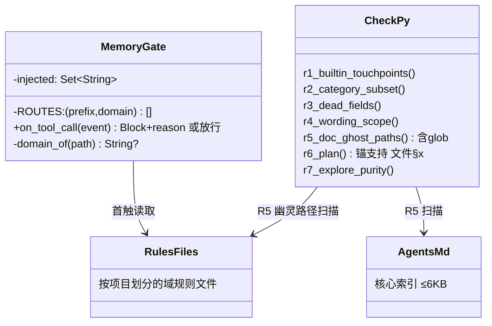

# bcp-kit — BCP 蓝图完形协议

> 开发范式工具包。开发只有三方：**元**（用户）定方向、**阳**（LLM）完形产出、**阴**（符号系统）机械裁决并记账。
> 本文档既是范式说明也是使用说明。范式没有终审结论——每条约定都讲清为什么，且可随账本证据演化（§4）；改它 = 改 Markdown，下次会话生效。

## 工作流总图

```
意图(NL) ──元裁决──▶ B(设计) ──检索熔化──▶ P(计划) ──阳完形──▶ C(代码)
                    固化回流 ◀──────── 阴·机械对碰 ◀───────────┘
```

四个工件沿链相变：**B 设计**（固，元批准）→ **P 计划**（气态内容物，agent 消费）→ **C 代码**（固，唯一实现事实）→ **A 规则**（液，回流沉淀）。经验规则反复被召回/验证后，经门控结晶为 **S 技能**（固，液→固相变，§2.4/§4.2）。两个关键相位：**阳完形**（LLM 填空，与组装并列的两个概率相位之一）与**阴对碰**（零 LLM 机械裁决）。

> 配套工件（§8.1 最小契约）：转化协议 `plan.md`（P 的 schema）· 工作流内核 `.pi/APPEND_SYSTEM.md`（A 的注入样本）· 机械对碰器 `bcp/check.py` + `bcp/bcp.toml`（阴）· 证据账本 `bcp/ledger.jsonl` · 实现事实 `AGENTS.md`。
>
> **宿主无关**：本 spec 与 `bcp/` 机械件只依赖 Python 3.11+ 标准库；`.pi/` 件为 pi 宿主适配层（换宿主只需重写该层，§8.1）。

---

## 0. 三方模型与上下文相变

### 0.1 三方：元、阳、阴

开发里只有三方，各司其职：

| 方 | 是谁 | 干什么 | 性质 |
|---|---|---|---|
| **元**（用户） | 人 | 提意图、批准设计、裁决演化候选 | 唯一能对「好不好」负责的一方 |
| **阳**（LLM） | 语言模型 | 在给定上下文里完形：起草计划、写代码、写文档 | 概率性：上下文形状越完整，输出越收敛 |
| **阴**（符号系统） | 编译器、测试链、git、`bcp/check.py`、账本 | 确定性验证与记录：编译不过就是不过，对碰 FAIL 就是 FAIL | 确定性：同输入永远同输出，无立场 |

编码域的阴大部分是现成的——**编译器和测试链就是天然的阴**。BCP 补的只是编译器管不到的接缝：计划与实现的对账（`check.py`）、注入与回流的记账（`ledger.jsonl`）。给自带裁判器的域强上完整循环是反模式（§7.7 域错配）。

**合理性来源**：阳的概率输出必须被阴的确定性裁决覆盖；元只在阴裁决不了的地方出手（设计取舍、候选采纳）。凡「阳自己检查自己」的安排都是作弊（§7.3）。

**为什么拆段**：意图→代码的直接映射一对多、不可校验。插入中间对象，拆成 `意图 →(元)→ B →(组装)→ P →(阳)→ C` 三段，每段单独可检：B 是不是用户要的（元裁决）、P 是否引用了真实的设计章节（阴查锚）、C 是否恰好填满 P 声明的空格（阴对碰）。全局不可检；**分段可检且误差逐段可归因 = 接近无损的可执行含义**。

### 0.2 相变：上下文窗口内外的流动

智能运行的物质条件是上下文窗口。窗口内是「此刻在想什么」，窗口外是「已经存在什么」。开发的全部流动，就是让内容在窗口边界有序进出：

| 相 | 在哪 | 是什么 | 例子 | 流动规则 |
|---|---|---|---|---|
| **气** | 窗口内 | 会话上下文 | 当前任务、当前计划、正在看的代码 | 任务结束即消散——消散是特性，不是损失 |
| **液** | 窗口外，可整体倾倒 | 规则与经验储层 | `.pi/rules/*.md`、技能手册、失败模式 | 按需注入窗口（闸门控制），在窗外持续演化 |
| **固** | 窗口外，检索式 | 仓库事实 | 代码、设计文档、技能、账本 | 只检索所需片段，永不整体进窗口 |

一轮任务就是一轮完整相变：**组装**（熔化固体的设计章节 + 倾倒液体的规则 → 气态计划）→ **阳完形**（气态计划 + 规则 → 固态代码）→ **阴对碰**（机械裁决 → 液态记录入账本）→ **固化回流**（值得留的压回液或固：避坑入规则、设计入文档、事实入代码、经验结晶为技能）。

阴的对碰依据是三条无损判据：① **覆盖**——下游对上游每个承诺有对应物；② **无发明**——下游不引入上游没有的承诺；③ **引用可解析**——跨工件引用全部落锚。三者成立，损耗就从静默事件变成可检测事件。

## 1. 对象模型

| 对象 | 相态 | 受众 | 生命周期纪律 |
|---|---|---|---|
| 会话上下文 | **气**（容器本身） | — | 每任务新建，天然消散 |
| P 计划 | **气·瞬态内容物** | agent | 注入→完形→删除；成功即消散；失败压缩为失败模式典藏（见下）；尸体可留档审计，**不得回注后续容器** |
| A 规则内核 | **液**（储层） | agent | 持续形变（汇流/晋升/降级）；按需倾倒；受墙约束（§6） |
| S 技能 | **固·凝固的液体**（可选轨道） | agent+元 | `deliverables/<name>/SKILL.md`；从液态经验/裸跑轨迹结晶，带适用条件+操作程序+验证凭证+溯源（§2.4）；检索式召回（description 命中才读正文，§5.5）；结晶与再演化经 §4 门控 |
| B 设计文档 | **固**（晶体） | 人类 | 入库需元批准（§4.1）；按需检索，不常驻 |
| C 代码 | **固**（晶体） | 机器+agent | 唯一实现事实；接口与类型的最终仲裁 |

四条纪律：

- **相态判据是形变方式，不是注入频率**：A 每次会话被注入，但它本体在容器外被每个任务的回流持续重塑——这是液体。B/C 只在越垒时相变——这是晶体。
- **派生文档不允许原创事实**：A（含嵌套文件、skill 手册等派生层）的每条事实性断言必须可溯源到代码或 B。违反即腐烂（先例：CLI 手册滞留已删除的恢复机制）。
- **跨任务连续性只由回流沉淀物（A/B/C）承载**。过程上下文跨任务存活 = 上一任务的空格形状污染下一任务的补全。
- **失败典藏永续（失败 ≠ 废料）**：FAIL 的 P、阴驳回的理由、阳的无效尝试，必须压缩为**原子模式**（标题 + 规避句，≤200 字符），追加写入 `bcp/ledger.jsonl`（mode=failure，字段见 §9.1）与 `.pi/rules/<域>.md`（避坑条目）。后续先验注入只含「标题+规避句」，不注入失败的具体上下文——**模式是规则（液体，可回注），尸体是过程上下文（禁回注）**。失败模式比成功模式更有进化价值：系统不重复踩同一个坑。

## 2. 工作流：转化链与四阶段

> 每个任务 = 一个完整循环。接缝表定责任（哪段错了归谁），四阶段定时序（先做什么后做什么）。P 即 SKILL.state 意义上的执行状态 Σt（充分统计量）：一切未来决策所需信息落在计划文件里，过程可丢。

### 2.1 转化链与接缝

| 接缝 | 检查类型 | 范式承诺 |
|---|---|---|
| 意图→B | 不可机械校验（设计主权，分布外） | 只承诺留痕（B 记录设计决定），不承诺无损 |
| B→P | 引用解析 + 覆盖检查 | P 的 blueprint 锚必须落进 B 实际章节 |
| P→C | 声明对碰 + accept 判据 | C 恰好填满 P 的空格，双向（做了没声明 / 声明了没做） |
| C→A/B | 回流弱信号（warn 级） | 检测「该回流未回流」的信号，不阻断 |

### 2.2 四阶段（三相循环的开发版）

| 阶段 | 相变 | 职责 | LLM 触点 |
|---|---|---|---|
| 组装 | 熔化+汽化 | 按 §2.3 注入开关读 B 相关章节 + A 倾倒样本 + 代码索引对账 → 产出 P | 起草 P 内容（schema 由协议定，模型填空不定义空格） |
| 阳完形 | 气态执行 | 消费 P + A 内核产出代码，accept 即空格填满 | **两个概率相位之一：完形 C** |
| 阴对碰 | 液化 | 机械对碰产出裁决与账本记录（§3） | **零 LLM** |
| 固化回流 | 固化+汇流 | 避坑→A（无垒）、设计→B（需批准）、事实→C（§4） | 零 LLM（候选可由 LLM 起草，采纳是元的） |

### 2.3 双模注入（探索裸跑 / 生产先验）

> 证据（WikiSkill, Tang et al. 2026, Table 3 消融）：执行类任务提前注入知识库会让阳走捷径，产出的轨迹对技能进化贬值（-2.8%）。

| 模式 | 计划标记 | 组装纪律 |
|---|---|---|
| **探索**（技能进化 / 轨迹采集类任务） | `mode: explore` | **空上下文注入**：不读储层、不给案例召回，只给环境工具——阳在裸跑中犯错，产出高纯度原始轨迹 |
| **生产**（推理类任务，缺省） | `mode: infer` | 恢复默认注入：UCB top-K + 案例召回，用储层加速决策 |

- **机械面（R7）**：计划头 `mode` 字段必检——产出 `SKILL.md` 或标记 `skill_evolution: true` 的任务必须 `mode: explore`，否则 FAIL。运行时注入行为静态不可检，由计划声明 + 账本审计兜底。
- **纪律钩子**：探索任务的组装禁止检索 `.pi/rules/` 与归藏资产（工作流内核 §2）。

### 2.4 技能契约（液→固相变产物）

> 技能是液态经验（避坑规则、裸跑轨迹）经提炼与门控结晶成的固态资产：比规则更结构化（适用条件+操作程序+验证凭证），比蓝图更可执行。证据（WikiSkill, Tang et al. 2026 主结果）：纯文本 Markdown 规则平均 +17~24% 且跨模型迁移好；强制编译 Python 的工程成本（编译耗时 / 冒烟压测）在绝大多数场景 ROI 为负。

- **默认产物双轨**：阳产出 `deliverables/SKILL.md`（纯文本规则 + Frontmatter 元数据）+ `deliverables/declaration.yaml`（结构化自声明）。
- **编译降级为可选优化**：Python 固化仅在 ① 人类显式 `--compile-python`，或 ② 文本规则验证集成功率 ≥95% 时触发一次；其余场景文本即技能。
- **与 taiji 蓝图旧规⑥不冲突**（档案）：文本技能走 prompt 注入轨道，不是机械执行体——「执行体统一 Python」继续成立；运行时文本技能类型为候选扩展（§8.2 待做）。
- **机械衔接**：① 结构闸 **R8**（check.py）——`deliverables/<name>/SKILL.md` 必须带 frontmatter 三件套（`name`/`description`/`validation`）+「适用条件」节 +「溯源」节，无结构不结晶（无目录静默跳过）；② 召回挂载——pi 宿主在 `.pi/settings.json` 挂 `deliverables`（**渐进披露：description 一行常驻系统提示、正文按需读**，全局可见受 §6 墙约束；技能是任务语义匹配，不绑代码路径域；可选 `domains: [...]` 字段仅作分组统计）；③ 召回记账——memory-gate 对读技能正文追加 `kind=skill-recall` 事件，evolve ⑦ 节统计（召回=0 = 死重候选）；④ **注册对碰**——注册凭证 = ledger `PROMOTED` 裁决记录（`kind:"skill"`, `target`=技能名，结晶经能垒的账本证据）；⑦ 节双向对碰：有目录无记录=绕能垒结晶，有记录无目录=幽灵注册（R6 声明↔实现同构）。

## 3. 阴：机械对碰

| 对碰层 | 内容 | 失败路由 | 同构 |
|---|---|---|---|
| 律令层 | 引用解析、声明对碰（双向）、发明检测 | 打回 P（重组装） | BackToMeta |
| 原子判据 | accept 命令全绿 | 打回 C（重完形） | BackToZhouyi |
| 经验层 | A 注入的软规则 | 不打回，记入账本 | soft violation |

（同构列为 taiji 内核的对应路由名，档案对照。）

- **失败必须标注断的是哪个接缝**：组装错改计划，完形错改代码，两类错误两类打回，不混。
- **check 禁止 LLM judge**：概率验证概率 = 阳自查自证。对碰器只能是确定性程序（grep/AST/命令执行/diff）。
- **门控顺序（双保险，符号阀前置）**：① 经验阀——验证集分数上涨只产生**采纳候选**；② 符号阀——`check.py --collision` 的引用悬空类机械检查（模板开箱 R5–R7；注入风险 / 路径逃逸等为项目专属，按 §5.4 案例凝结进 R1–R4）**一票否决**，验证集满分不抵消符号 FAIL。统计分数进不了判据表（taiji 蓝图旧规⑬，档案），只能决定候选优先级——软分数可以提效，不可以越权。

## 4. 固化回流

> 回流是循环的固定相变，不是「记得做的美德」。本节回答三个问题：谁裁决（4.1 能垒）、怎么变（4.2 演化算子）、凭什么变（4.3–4.6 证据流与报告器）。

### 4.1 能垒

**元批准 = 结晶能垒**。设计入 B 需元裁决（晶体不自校正，错误设计污染此后所有检索）；避坑汇入 A 无垒（液体自校正，错规则会被演化算子冲掉）；经验规则律令化（凝结进 check）无需能垒——判据可机械验证，证据即凭证。

### 4.2 演化算子

- **证据账本**：对碰器每次运行追加 `bcp/ledger.jsonl`（rule_id / severity / finding / 时间）。这是规则的违反证据流。
- **晋升**：散文规则反复违反且可机械化 → 凝结为 check 规则（bcp.toml + check.py），从 A 内核删除原散文。
- **结晶**（液→固）：经验规则/裸跑轨迹反复被召回且验证有效 → 提炼为 `deliverables/<name>/SKILL.md` 固态技能（带溯源与验证凭证）；有验证集时经验阀可自动门控（§3 门控顺序在「有裁判域」的放宽），无验证集时走能垒。
- **降级**：长期零命中且未防过事故 → 迁入 B 叙事或删除。
- **回流协议**：任务终态固定产出 ≤3 条避坑候选（入 A，无垒）+ 0–1 条设计候选（入 B，需批准）。FAIL 任务额外强制产出一条失败模式（mode=failure 入账本 + 避坑入 A，见 §1）。可复用的成功轨迹按 §2.4 双轨沉淀，编译不默认。

> 佐证：WikiSkill 自认缺 wiki 自动修剪（limitations）；本范式以 evolve 死重/降级候选覆盖此缺口。

### 4.3 统一证据流

> 设计动因：§4.2 的晋升/降级算子原本无消费者。约定：证据流统一进 `bcp/ledger.jsonl`（append-only），新增零 LLM 报告器产出候选数据，裁决权在元。

| 生产者 | mode | 内容 |
|---|---|---|
| check.py | static / plan / plan+collision | findings[rule,sev,msg]（详见 §9.1） |
| memory-gate | gate | 注入/召回事件：域注入 {domain, file}；技能召回 {kind:"skill-recall", target:<技能名>}；append 失败仅跳过，绝不阻断工具执行 |
| evolve.py | evolve | 每次报告的审计痕迹（候选清单） |

**容量与生命周期**（2026-09-12 审计定案）：

- **append-only 永久保留**：账本=证据流，不滚动、不截断、不聚合——滚动=可篡改。`--window` 只是读取视图，存储全量。估算十年 <10MB，性能无虞。
- **单条上界**：findings 落账截断 top50、msg≤200 字符，附 `findings_truncated: N`（全文在 stdout，账本只需索引）——单条体积 ~15KB 封顶。
- **归档暂缓**：>5MB 再议 `git mv` 冷归档 + evolve 读 glob——无证据的工程=过早优化；时机由 selfcheck 账本健康项的数据说话。
| 固化回流·失败典藏 | failure | 压缩失败模式 {title, avoidance, domain}（§1） |

总装图：



### 4.4 evolve.py 报告器（零 LLM，纯标准库，守 §8.1 移植契约）

- 输入：`bcp/ledger.jsonl` + check.py 源中的规则名注册表（正则机械提取 seam 表键，不建副本）+ `.pi/rules/` 清单。
- 输出：纯文本报告七节（见 §9.3）。
- 参数：`--window N`（天，默认 30）、`--min-hits M`（默认 3）、`--ledger <path>`（默认 `bcp/ledger.jsonl`，测试可指向空账本验冷启动）。退出码恒 0（报告非裁决）。
- 每次运行追加 mode=evolve 审计记录（候选以 findings WARN 形式入账）。

部件图：



### 4.5 晋升与降级执行（守 §4.1）

- **晋升**：报告给出高频候选 → 元批准 → agent 执行（散文规则凝结进 `bcp/bcp.toml` + `bcp/check.py`，原散文从 rules 文件删除）→ `/check` 全绿即凭证，无额外能垒。
- **裁决落账**：晋升/结晶获批 / 被拒后追加一条 ledger 记录 `{mode:"evolve", verdict:"PROMOTED"|"REJECTED", target:"<规则名或技能名>", kind:"skill"（技能裁决必标，与规则晋升区分）, source:"<来源失败模式标题，可选>", note:"<原因>"}`——append-only 下以此实现失败模式→规则/技能的溯源（不回填历史记录），evolve ⑥ 节回放 + ⑦ 节注册对碰（kind=skill 的 PROMOTED ↔ deliverables 目录），被拒候选不重复提案（WikiSkill skill-impact 同构）。
- **降级**：报告给出零命中/死重候选 → **必经元裁决**（「未防过事故」不可机械测；零命中的低频高害规则如 R1/R2/R4 不宜自动降）→ 批准后迁 B 叙事（项目 Blueprint.md / 本 README）或删除。

### 4.6 冷启动语义（gate 证据无效期）

> 设计动因：管道刚落地时账本 0 条域注入事件，④ 节把全部规则文件误标「死重候选」（2026-09-07 首份报告实证，5 文件全列）。规则：死重判定必须有管道活性证据。

- **冷启动判定**：账本中无任何**域注入**事件（mode=gate 且 kind=domain；big-read / compact-restore 不算）。
- **冷启动报告**：④ 节不列死重候选，改列全域「待积累」清单；报告头部标注 `[冷启动]` 状态。
- **常态门槛**：≥1 域有注入即管道活性已证，其余未注入域照列死重候选（报告非裁决，元看数据判断）。
- **set 语义红线**：死重判定只用「从未注入」（set 语义），禁用「注入计数低」推断死重——gate 每域每会话去重，计数天然低频，低计数 ≠ 死重。
- **审计痕迹**：mode=evolve 记录增补 `cold_start` 布尔字段。

### 4.7 Sleep 机制与命令（演化节律：正反旋转，逆转阴阳）

> 设计动因：液态经验积压、储层熵增、工作流逃逸都依赖「有人记得跑巡检」——pi 无 cron，靠自觉必然衰减。sleep 把巡检从自觉变成节律：**agent 的代谢是 commit，不是墙钟**。

- **触发（入睡）**：memory-gate 第 4 注入点（kind=sleep）——会话首调时检查活动量判据 `当前 commit 数 − 最后一条 evolve 记录的 commits 基准 > 30`，超阈则 block 一次注入提醒（重发即放行，会话只催一次）。冷启动豁免（无记录按 0 起算）；非 git 项目 commit=0 天然 fail-open。
- **执行（清单流，/sleep 命令）**：① 机械对账（evolve.py + selfcheck，零 LLM）→ ② 列清单落盘 `bcp/sleep/<date>-sleep.md`（每条 `- [ ]` 含来源+建议处置）→ ③ **呈元逐条裁决（能垒，阳不得代裁：PROMOTED/REJECTED/降级/删除/挂起）** → ④ 执行+打勾 → ⑤ 清单全勾 → 删清单（过程可丢，账本留痕）。
- **停止（睡醒）**：醒来 = 新的 evolve REPORT 记录落账（含 commits 对账基准）→ 判据自动归零。睡没睡、裁决了什么，全是账本上的行，不靠任何一方的自觉或记忆。
- **对碰税 = 显式支付的维护代价**（同生物睡眠不是浪费）：对账即固化（液→固相变的节律入口），打勾即归一化（用进废退的执行面），落账即元觉知——系统在符号层持有一个自我状态模型，并按代谢节律自动发起对它的裁决。

## 5. 记忆分层（A 内核四层，宿主侧落地）

> 设计动因：pi 无跨会话记忆，上下文文件即记忆。AGENTS.md 全量 42KB 常驻违反 §6 墙纪律；嵌套文件+自觉 read = 纪律依赖反模式（§7.5）。规则：按可靠性分四层，每条规则必须落一层，不允许无主散文。

### 5.1 四层（按可靠性降序）

| 层 | 机制 | 触发方式 | 腐烂面 |
|---|---|---|---|
| 1 凝结 | 规则 → check.py R 规则 / 项目测试链 | 违反即红，零阅读依赖 | 无（跟代码走） |
| 2 触点注释 | 单文件局部规则 → 代码触点 doc comment | 改代码必读文件，任务本身即触发 | 无（删代码即删规则） |
| 3 机械注入 | 跨模块规则 → `.pi/rules/<域>.md` + memory-gate 扩展 | `tool_call` 按文件路径前缀拦截，首次触碰域 → block + reason 携带规则全文，重试即带规则执行 | 每规则单一来源；R5 扫幽灵路径 |
| 4 核心索引 | AGENTS.md 只留环境信息 + 路径索引 + 类型索引 + 跨域硬约束，≤6KB | 每会话常驻 | 路径由 R5 守护 |

### 5.2 总装图



### 5.3 部件图



### 5.4 分流审计（案例：taiji 实例原 AGENTS.md 24 节 → 去处）

| 原节 | 去处 |
|---|---|
| §0 文档首要 / §4 错误测试 / §6 无降级 / §5 解析一句话 / §17-git-checkout | 层4 核心（跨域硬约束） |
| §5 解析细则 | 层2 json_util.rs::parse_llm_json 触点 |
| §17 symlink 逃逸 / redirect SSRF / write 相对路径 | 层2 common.rs / webfetch.rs / write.rs 触点 |
| §19 ToolCall/ToolSchema 序列化 | 层2 llm.rs 触点 |
| §2 §3 §13 §19余 §20 §21 §23 | 层3 `.pi/rules/agents.md`（src/agents/） |
| §1 §7 §10 §11 §12 §14 §16 §22 §17-max_depth | 层3 `.pi/rules/orchestration.md`（src/orchestration/，src/mcp/） |
| §8 §9 §18 | 层3 `.pi/rules/infra.md`（src/infra/） |
| §17-serde(default) | 层3 `.pi/rules/types.md`（src/types/） |
| §15 | 层3 `.pi/rules/frontend.md`（src/ws/，taiji-web/） |
| §20 六触点 / §9 kind⊆cat / §13 死字段 / §14 措辞 / §16 幽灵基建 | 层1（已凝结 R1–R5，prose 收一行指针） |

（本表节号为 taiji 实例 AGENTS.md 原节号，案例档案指针。）

### 5.5 注入闸门纪律

- 拦截仅作用于 read/edit/write 三工具的 path 参数；bash 是已知缺口（改代码主路径是 edit/write，残余风险归项目 AGENTS.md 既有坏习惯条款）。
- 规则文件缺失 fail-open 放行 + notify（不能死锁）；会话内每域只拦一次（Set 去重）。
- 拦截时机在工具执行**前**：被拦调用不落盘，规则先落上下文，重试才执行——无「已执行才收到规则」窗口。
- **召回漏斗原则**：沉淀与召回成本不对称——写入异步便宜，召回每次会话付税。故写入永远允许，召回严格设闸；宁可漏（重复踩坑一次，事后补沉淀）不可胀（每次会话都变贵变钝）；人工显式入口兜底。知识按常驻成本分层：常驻索引（层4，≤6KB）→ 域触发（层3，memory-gate）→ 匹配召回（skill description 命中才读正文）→ 冷储（不注册，grep/点名才注入）。
- **规则文件组织（模式页）**：每条规则 = 问题 + 根因 + 证据 + 规避句（10–30 行），文件头一行式目录（问题+根因+修复一句话）——召回时看目录判断相关性，不整读全文（渐进披露；WikiSkill index.md 同构）。规则页注「来源」（源自哪条失败模式 / 哪次任务）。
- **规则写作纪律**：记条件与根因（何时适用、为什么错），不记低层操作技巧——低层 workaround 会随模型升级变负资产（WikiSkill 跨模型负迁移实证：小模型单行技巧把强模型 50.5% 拖到 18.1%）。

## 6. 墙纪律（上下文预算）

- A 内核 ≤ ~1.5k token；嵌套规则文件 = 按需倾倒（**墙管注入样本的体积，不管储层总量**）；B 允许大（检索式读取，不随请求加载）。
- **压缩纪律**：compaction 摘要只当导航，恢复后一切进度以计划文件勾选为准——摘要式压缩会破坏结构化状态（SKILL.state, Badhe et al. 2026 预算匹配实验：滑窗截断 0.18 / 统计压缩 0.22 vs 结构化状态 0.94）。
- **先凝结后收缩**：A 减肥之前，可机械化的规则必须先凝结进 check。顺序反了，液体不是流动而是蒸发——规则直接丢失。

## 7. 反模式（范式预先排除的失败）

1. **SDD 膨胀**——B 无限增长。免疫：B 检索式不常驻，A 有墙。
2. **散文计划**——无结构 P 无法对碰，损耗静默。免疫：P 强制 schema。
3. **LLM 自查自证**——check 用模型判模型。免疫：对碰器零 LLM。
4. **副本腐烂**——事实多处存储。免疫：单一权威 + 引用可解析 + 派生文档不原创事实。
5. **纪律依赖**——靠记忆更新文档。免疫：回流协议 + 回流弱信号 + 过期检测。
6. **过程上下文跨任务存活**——旧空格污染新补全。免疫：P 成功即消散。
7. **域错配**——给自带裁判器的域上重机制（编码域自带编译器/测试/机械检查，元可外包给人、阴可外包给工具链，单 LLM 循环即够）。免疫：最小架构是域的函数——三相循环仅在「人不在场 + 无现成裁判」的开放域成立（§8.3）。

## 8. 边界与宿主

### 8.1 最小契约

三文档（本 README / `plan.md` 协议 / A 内核）+ 一个对碰器（`bcp/check.py`，规则外置 `bcp/bcp.toml`）+ 一条账本（`bcp/ledger.jsonl`）。对碰器只依赖 Python 3.11+ 标准库，随项目移植时复制 `bcp/` 与三文档协议即可。

### 8.2 落地状态

- 实例落地状态不属本 spec（各项目自记，如 taiji 仓库的实例层，V83 已冻结）。
- 本仓库（范式模板）：`bcp/` 对碰器（R5 引用完整性 / R6 计划对碰 / R7 探索纯净开箱即用；R1–R4 项目专属按需配置）+ `--selfcheck` 闸门空转自检；`.pi/` 工作流内核四步化 + memory-gate 四闸门（域规则 / 大文件附注 / compaction 恢复 / sleep 节律）+ pre-commit 提交闸门。
- 未落地候选（范式承诺 vs 机械现状，按 §4.2 攒证据后凝结）：C→A/B 回流弱信号（§2.1）、对碰经验层 soft violation（§3）、B→P 覆盖检查（§2.1，当前仅锚解析）、运行时文本技能类型（§2.4）。

### 8.3 宿主-被试主从定位（V81）

> 设计动因：曾设想「专用内核既是开发范式又是被开发主体」（自指）。约定：不自指——范式真源在宿主侧（提示词 + 零 LLM 脚本），专用内核是验证载体。案例：taiji 内核（V83 已冻结，复苏条件见其 Blueprint）。

- **范式真源在宿主**：本 spec / A 内核 / 对碰器的运行载体是通用 agent 宿主（提示词 + 零 LLM 脚本）。改范式 = Markdown diff，下次会话生效，成本近零、行为可预期。专用内核跑范式 = 自带状态重建 + 每轮裁决的 token 税，属 §7.7 域错配。
- **内核是被试/磨刀石**：其价值在验证「递归分解 + 符号裁决 + 记忆分层」架构能否成立，不在替人管理开发。观察它的变化不需要自指——git + check + trace 已是观察。内核的失败喂养范式：失败暴露范式缺口 → 在宿主侧调精召回闸门。
- **pi 保留 stage0 锚点**：范式失效时人工用 pi 直修 spec，修完再交回。自指系统需外部不动点。
- **双轨只收机械层**：裁决/演化若收进内核，只收零 LLM 机械层（check 规则、账本→证据流）；LLM 重层（递归分解、元认知）永留宿主。机械层便宜、可测、无观察者污染。
- **自指门槛**：仅当专用内核瘦到「一次完整循环成本 ≈ 宿主一个会话」时重新评估。换宿主触发条件同理：仅当① 现宿主钩子无法机械化的关键编排需求，且② 测量确认价值 > 迁移成本时评估（全插件 harness 为候选之一）。

## 9. 账本与术语速查（不看源码也能懂）

### 9.1 `bcp/ledger.jsonl`（证据账本）

每行一条 JSON 记录，由符号系统自动追加（append-only，只增不改）。它是所有裁决的证据流，也是 `evolve.py` 报告的唯一数据源。人不需要读它——但要能看懂它记了什么：

| 字段 | 含义 |
|---|---|
| `ts` | 时间戳 |
| `mode` | 谁写的 + 什么场景，见下表 |
| `verdict` | 结果：`PASS` / `FAIL`（check 裁决）；`INJECTED`（gate 注入成功）；`FAIL_OPEN`（gate 规则文件缺失，放行不阻断）；`REPORT`（evolve 报告） |
| `fail` / `warn` | 本条记录中 FAIL / WARN 级发现的条数 |
| `findings` | 发现清单，每条 `{rule, sev, msg}`：`rule`=触发的规则名（见 9.2），`sev`=严重级（FAIL 阻断 / WARN 提示），`msg`=内容与修复方向 |

`mode` 取值一览：

| mode | 谁写 | 什么时候 |
|---|---|---|
| `static` | check.py | 不带 `--plan` 的静态扫描（pre-commit 提交闸门跑的就是这个） |
| `plan` | check.py | `--plan` 计划检查（含 accept 命令真实执行） |
| `plan+collision` | check.py | 再加 git 双向对碰：声明了没改 / 改了没声明，双向都 FAIL |
| `gate` | memory-gate 扩展 | 五种事件，看 `kind` 区分：`domain`（首次触碰某代码域，强制注入该域规则）；`big-read`（整读 >20KB 文件的定位提醒）；`compact-restore`（会话压缩后恢复进度提示）；`skill-recall`（读 `deliverables/*/SKILL.md` 正文 = 技能被召回，纯记账不拦截）；`sleep`（活动量超阈，催一次巡检，§4.7） |
| `evolve` | evolve.py | 三种：**REPORT**=演化报告器运行的审计记录（本次产出哪些候选）；**PROMOTED / REJECTED**=晋升/结晶候选经人批准/拒绝后的裁决记录，字段 `target`=规则名或技能名（技能裁决必标 `kind:"skill"`）、`source`=来源失败模式标题（可选溯源）、`note`=原因——⑥ 节回放防重复提案；kind=skill 的 PROMOTED 同时是技能注册凭证，⑦ 节与 deliverables 目录双向对碰 |
| `failure` | agent 按协议追加 | 任务以 FAIL 收尾时的**失败典藏**：`{title, avoidance, domain}` = 标题 + 规避句（≤200 字符）+ 所属域。只留模式，不留过程——这是给后续任务回注的「别再踩」规则 |

### 9.2 check.py 规则（R1–R7）

| 规则 | 查什么 | 状态 |
|---|---|---|
| R1 builtin-touchpoints | 工具执行体存在且全部注册点出现 | 项目按需（示例配置在 bcp.toml） |
| R2 category-subset | kind 集 ⊆ category 集 | 项目按需 |
| R3 dead-fields | 已废弃字段无消费点 | 项目按需 |
| R4 wording | 禁用措辞扫描 | 项目按需 |
| R5 doc-ghost-paths | 文档反引号里的仓库路径必须存在（防幽灵基建） | 开箱即用 |
| R6 plan-collision | 计划锚引用真实章节 + accept 全绿 + git 双向对碰 | 开箱即用 |
| R7 explore-purity | 产出 SKILL.md / skill_evolution 的任务必须 `mode: explore` | 开箱即用 |
| R8 skill-contract | `deliverables/*/SKILL.md` 结构：frontmatter 三件套（name/description/validation）+ 适用条件节 + 溯源节 | 开箱即用（无目录静默跳过） |

每条 FAIL 裁决自带修复方向：改代码 / 改文档 / 改计划（R6 按条目标注）。

### 9.3 evolve.py 报告七节

定期手动跑，产出晋升/降级**候选数据**（报告非裁决，裁决权在元，§4.5）：

| 节 | 内容 | 用途 |
|---|---|---|
| ① 规则命中 | 各 R 规则全历史/窗口内命中数、末次命中 | 高频违反 = 晋升候选（值得凝结为机械规则） |
| ② 域注入计数 | 各代码域规则被注入次数 | 记忆分层管道是否在干活 |
| ③ 降级候选 | 窗口内零命中的规则 | 长期没用上 = 可能该降级或删除 |
| ④ 死重候选 | 从未被注入的规则文件 | 冷启动期（无任何域注入事件）改列「待积累」，不作死重判定 |
| ⑤ 强化证据 | 窗口内高频 FAIL 规则 | 同 ①，聚焦近期 |
| ⑥ 晋升裁决史 | 历次 PROMOTED/REJECTED 裁决记录 | 被拒候选勿重复提案（WikiSkill skill-impact 同构） |
| ⑦ 技能资产 | deliverables/*/SKILL.md 清单 + 召回计数 | 召回=0 的技能是死重候选（结晶后没人用 = 该回炉或删除） |

### 9.4 `--selfcheck`（健康自检）

装完或换宿主后跑一次：报告各闸门依赖是否就绪。`IDLE` = 依赖缺失、闸门空转（形同虚设）；`OK` = 就绪。含 sleep 巡检节律项（活动量 x/30 commit，超阈 IDLE——跑 evolve.py 落账即重置）。退出码恒 0（报告非裁决）。

## 10. 使用指南

### 10.1 适用边界

BCP 的三相循环为「人不在场 + 无现成裁判」的开放域设计（§7.7 域错配）：

| 适用 | 不适用 |
|------|-------|
| 需求模糊、无现成测试、LLM 需独立完成多轮迭代的域 | 有完整 CI/CD + 测试覆盖的成熟代码库（自带裁判器） |
| 人只给设计、无法逐行 review 的场景 | 人可实时结对 / 逐行 review 的场景 |
| 需要跨会话、跨模型、跨人员的经验累积 | 一次性脚本、探索性原型 |

装错域 = 给自带裁判器的域上重机制，白付对碰税。

### 10.2 两层结构（诚实边界）

| 层 | 件 | 归属 |
|---|---|---|
| 工具包 · **真宿主无关** | 本 README（含范式 spec） · `plan.md` · `bcp/`（check.py / bcp.toml / evolve.py / ledger） · `deliverables/`（技能资产，可选轨道） | 复制到任何项目，只依赖 Python 3.11+ 标准库（§8.1 最小契约） |
| 工具包 · **pi 专属适配** | `.pi/`（APPEND_SYSTEM 工作流 + memory-gate 四闸门 + bcp-check + prompts） | **换宿主 = 必须重写等价的机械注入层**，否则 §5 四层记忆分层与 §6 墙纪律只落地一半 |
| 项目实例 | `AGENTS.md`（项目索引） · `Blueprint.md`（可选设计文档） · `.pi/rules/*.md` · `bcp/plans/` | 各项目自养 |

`kit/` 为分发件（实例骨架 + pre-commit 模板），**不随项目复制**（防副本腐烂，§7.4）。

### 10.3 新项目快速开始

```bash
# 1. 复制宿主无关件 + pi 适配层到项目根（已有仓库）或以本仓库为模板新建
cp -r README.md plan.md bcp .pi <项目根>/

# 2. 填实例层
#    - AGENTS.md：按 kit/AGENTS.template.md 骨架填项目索引（≤6KB，check 不强制但墙纪律要求）
#    - bcp/bcp.toml：按需启用 R1–R4 项目专属规则（缺省跳过）
#    - .pi/extensions/memory-gate.ts：填 ROUTES 路径→域映射（空表 = 域注入空转）
# 3. 装提交闸门（hook 从源仓库 kit/ 取，kit/ 本身不进项目）
cp <bcp-kit>/kit/pre-commit <项目根>/.git/hooks/pre-commit && chmod +x <项目根>/.git/hooks/pre-commit
# 4. 范式健康自检：确认各闸门非空转（IDLE = 依赖缺失，形同虚设）
python3 bcp/check.py --selfcheck
# 5. 重启 pi 会话（.pi/ 变更需重启生效），再跑一次 --selfcheck 确认
```

### 10.4 机械闸门（零 LLM，不靠自觉）

| 闸门 | 触发 | 作用 |
|---|---|---|
| memory-gate 域注入 | 首次触碰 ROUTES 域文件 | block + 注入 `.pi/rules/<域>.md` 全文 |
| memory-gate 大文件附注 | read >20KB（每文件一次） | 提示先 grep 定位再 offset/limit 定点读 |
| memory-gate compaction 恢复 | `session_compact` 后首次工具调用 | 注入"重读计划文件"（计划 = 执行状态 Σt；摘要只当导航，状态以计划勾选为准，§6） |
| /check（R5–R7 通用，R1–R4 按需） | 手动或实现完成时 | 机械裁决，FAIL 带修复方向 |
| pre-commit | 每次 git commit | **只跑 static 规则集**（R5 等）；R6 计划对碰靠工作流中 /check 触发——失败留档的计划合法存在于 `bcp/plans/`，故提交闸门不跑 --plan（已知缝隙）。绕过 = `--no-verify`（人可见越轨） |
| evolve.py | 定期手动 | 晋升/降级候选数据，裁决权在元（§4.5） |

**开箱即用 ≠ 装完即安全**：R5 的保护范围 = docs 配置中文档的路径断言；R6 只在计划声明 blueprint 锚时对碰；R7 只在 files 含 SKILL.md 或 `skill_evolution: true` 时触发。空转的 check 比没有 check 更危险（虚假安全感）——装完先跑 `--selfcheck`。

## 11. 沿革

范式与机械裁决经验源自 taiji 认知内核项目（已冻结，tag `v82-frozen`）；演化沿革 V80–V83 见 taiji 仓库 `Blueprint.md`。

技术出处（原文见仓库根 `wikiskill.md` / `SKILL.state.md`）：
- **WikiSkill**（Tang et al., 2026, arXiv:2608.27454）——§2.3 双模注入证据（Table 3 消融）、§2.4 文本技能证据（主结果）、§5.5 模式页组织学（index.md 同构）、⑥ 节晋升裁决史（skill-impact 同构）、§4.2 wiki 修剪缺口佐证。
- **SKILL.state**（Badhe et al., 2026）——§2.2 计划 = 执行状态 Σt（充分统计量）、§6 压缩纪律（预算匹配实验）。
